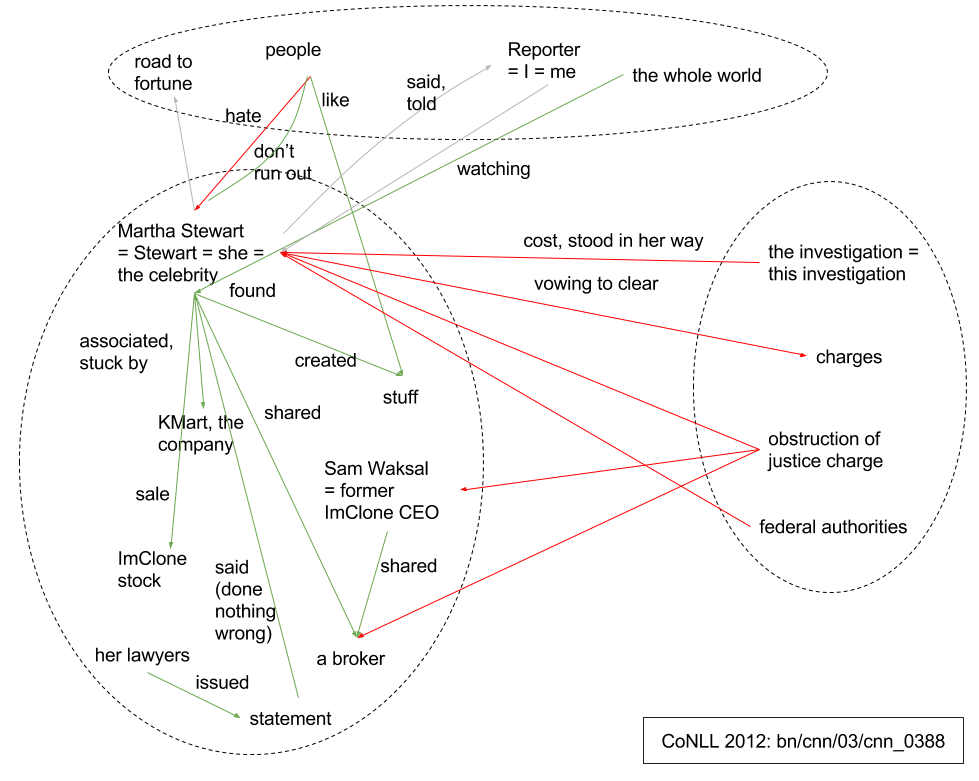
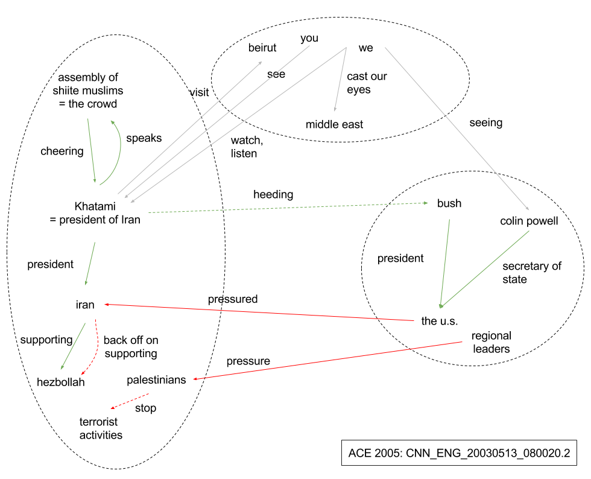

## Thu 12 Jan 2017

It took me 2 days to get the results of Stanford Neural Coreferencer. The 
instructions are not clear nor sufficient. Some traps are left, waiting for
innocent users, such as dir paths must be slashed. Eventually, I had to dig 
into the code. Well... that's kinda expected for academic software, isn't it? 

The final command for evaluating on CoNLL-2012 dev is:

```
nohup java -Xmx6g -cp stanford-corenlp-3.7.0.jar:stanford-english-corenlp-models-3.7.0.jar:* edu.stanford.nlp.coref.CorefSystem -props edu/stanford/nlp/coref/properties/neural-english-conll.properties -coref.data ../conll-2012-downloaded-2017-01-11/conll-2012/ -coref.inputPath ../conll-2012-downloaded-2017-01-11/conll-2012/v4/data/development/data/english/annotations/ -coref.conllOutputPath ../output/standford-neural-conll-dev -coref.scorer ../reference-coreference-scorers/v8.01/scorer.pl &
```

It ran for about 3 hours and and here are the results:

```
[main] INFO CoreNLP - Identification of Mentions: Recall: (17075 / 19143) 89.19%    Precision: (17075 / 42596) 40.08%   F1: 55.31%
[main] INFO CoreNLP - METRIC muc:Coreference: Recall: (10210 / 14602) 69.92%    Precision: (10210 / 12866) 79.35%   F1: 74.34%
METRIC bcub:Coreference: Recall: (11308.54 / 19144) 59.07%  Precision: (12044.91 / 16882) 71.34%    F1: 64.63%
METRIC ceafm:Coreference: Recall: (12422 / 19144) 64.88%    Precision: (12422 / 16882) 73.58%   F1: 68.96%
METRIC ceafe:Coreference: Recall: (2580.7 / 4542) 56.81%    Precision: (2580.7 / 4016) 64.26%   F1: 60.31%
METRIC blanc:Coreference links: Recall: (66477 / 98780) 67.29%  Precision: (66477 / 88350) 75.24%   F1: 71.04%
Non-coreference links: Recall: (460309 / 822370) 55.97% Precision: (460309 / 648850) 70.94% F1: 62.57%
BLANC: Recall: (0.62 / 1) 61.63%    Precision: (0.73 / 1) 73.09%    F1: 66.81%
[main] INFO CoreNLP - Final conll score ((muc+bcub+ceafe)/3) = 66.43
```

Found a very nice software for error analysis: [cort](https://github.com/smartschat/cort/blob/master/ANALYSIS.md#reading).

## Fri 20 Jan

Looking at the errors that Stanford neural coreferencer makes, I'm surprised 
that it misses obvious matching names such as "Hong Kong". I doubt that the 
string matching feature is missing but [Kevin](https://github.com/clarkkev/deep-coref/issues/2)
assures that it is there. So why doesn't it have any effect?

The training was unbearably slow (7 days with a GPU). I'm thinking of a 
reimplementation using [BigDL](https://github.com/intel-analytics/BigDL)
hopefully it will be faster.  

## Sat 21 Jan

Learned about BigDL. Plan: train on a many-CPU computer or a many-computer
cluster.

Tested redep-java on HPC Cloud with different number of CPUs (revision
`#b97232b37ed531e1039b5c5643c3e2503b67ef79`):

```
sudo mkdir /data
sudo mount /dev/vdb /data
sudo chmod 777 /data
sudo apt-get install -y maven 
sudo apt-get install -y openjdk-8-jdk

16 CPUs:
REINFORCE: Finished iter 4464 (63.68 min, 598.34 sentences/s)
RL-Random: Finished iter 678 (51.11 min, 113.36 sentences/s)

32 CPUs:
REINFORCE: Finished iter 3657 (45.02 min, 693.33 sentences/s)
RL-Random: Finished iter 674 (41.20 min, 139.80 sentences/s)
```

Command to run RL-Random:
```
nohup java -cp target/redep-0.0.1-SNAPSHOT-jar-with-dependencies.jar          nl.cltl.ulm4.dep.re.ReinforcementLearning          -train output/dep/penntree.sd/train.mrg.dep          -valid output/dep/penntree.sd/valid.mrg.dep          -pretrained stanford-parser-full-2014-10-31/PTB_Stanford_params.txt.gz -sampler random -maxIters 1000 -parser output/dep/sd-reinforcement-arc-standard-oracle.bin &
```

## Wed 8 Feb

Submitted ACL short paper, come back to this project. Wrote a [plan](plan.md).

Start reading event relation identification literature.

## Mon 13 Feb

Managed to run [deep-coref](https://github.com/clarkkev/deep-coref) on HPC VM
(`ssh ubuntu@minh-coref-0.newsreader-vu.surf-hosted.nl`). A lot of errors and
strange problems. Preprocessing was a pain but finally I obtained `data_raw`
and `gold` directory for training. Started `run_all.py`. 

## Tue 14 Feb

`run_all.py` ran for long hours and silently stopped. I restarted it on my 
laptop for debugging. It's spending very long time on `setup()` without even
starting training yet.

Running it like this doesn't work. I need to scale things down such that I can
do multiple rounds of the program within 10 minutes. Let's start with 
re-running the data exporter on a small number of documents...

OK, done. Now run `run_all.py` on the small dataset.

## Thu 16 Feb

[Studied](studying-deep-coref.md) more closely `pairwise_models.py`. As I 
suspected, the model is not so suitable for GPU. Training batches are small
and need to be transferred to GPU all the time. It would be much better to 
train this model on a bunch of CPUs instead.

Now the problem is to reimplement the model in BigDL and implement an 
asynchronous training algorithm (because locking after every small batch
wouldn't be much efficient, this might be the reason for poor speed-up factor
I observed for `redep-java`). I'm wondering what's the difference between 
training on a single multi-CPU machine and on on mulitple (virtual) machines.
With the later, I can use TensorFlow (one less library to learn and less code
to port since it's Python). Notice: TensorFlow can also run tasks on the same
machine (probably they would run on separate processes, i.e. no shared memory?
but at least the communication would be faster).

    If we wanted, we could add several tasks running on the same machine.
    https://ischlag.github.io/2016/06/12/async-distributed-tensorflow/

## Thu 2 Mar

the speed of my Torch redep (in training Chen&Manning parser)  
I can get now on HPC Cloud without GPU:

```
Epoch 33... Done (cost: 3.89, 15 s, 22.00k examples/s).
Epoch 34... Done (cost: 3.91, 16 s, 21.25k examples/s).
Epoch 35... Done (cost: 3.92, 16 s, 21.88k examples/s).
Epoch 36... Done (cost: 3.94, 16 s, 22.50k examples/s).
```

On DAS5 with Titan GPU:

```
Epoch 88... Done (cost: 3.92, 12 s, 73.33k examples/s).
Epoch 89... Done (cost: 3.93, 12 s, 74.17k examples/s).
Epoch 90... Done (cost: 3.90, 12 s, 75.00k examples/s).
Epoch 91... Done (cost: 3.91, 12 s, 75.83k examples/s).
Epoch 92... Done (cost: 3.95, 13 s, 70.77k examples/s).
Epoch 93... Done (cost: 3.92, 13 s, 71.54k examples/s).
Epoch 94... Done (cost: 3.92, 13 s, 72.31k examples/s).
Epoch 95... Done (cost: 3.93, 13 s, 73.08k examples/s).
```

In both cases, Torch was way better than Java (I switched to Java mainly for
reinforcement learning part but if I can work out a way to implement the
reinforcement learning algorithm faster, I might switch back):

```
######## Iteraton 1099
Cost: 0.095095, correct: 96.96%
PreComputed 100000, Elapsed Time: 1.123 (s)
Done (30.63 min, 5.99k examples/s).
######## Iteraton 1100
Cost: 0.093709, correct: 96.94%
PreComputed 100000, Elapsed Time: 1.159 (s)
Done (30.66 min, 5.99k examples/s).
```

I thought half-precision tensors would be faster but it turned out that they 
are slower or the same. This is after switching to cudaHalf(), plus using 
type-specific CUDA tensors (CudaByte, CudaLong):

```
Epoch 47... Done (cost: 3.93, 7 s, 67.14k examples/s).
Epoch 48... Done (cost: 3.94, 7 s, 68.57k examples/s).
Epoch 49... Done (cost: 3.93, 8 s, 61.25k examples/s).
Epoch 50... Done (cost: 3.93, 8 s, 62.50k examples/s).
Epoch 51... Done (cost: 3.91, 8 s, 63.75k examples/s).
Epoch 52... Done (cost: 3.92, 8 s, 65.00k examples/s).
Epoch 53... Done (cost: 3.89, 8 s, 66.25k examples/s).
Epoch 54... Done (cost: 3.95, 8 s, 67.50k examples/s).
Epoch 55... Done (cost: 3.93, 8 s, 68.75k examples/s).
Epoch 56... Done (cost: 3.91, 9 s, 62.22k examples/s).
Epoch 57... Done (cost: 3.90, 9 s, 63.33k examples/s).
```

This is after switching back to full-precision but keeping type-specificity:

```
Epoch 47... Done (cost: 3.90, 7 s, 67.14k examples/s).
Epoch 48... Done (cost: 3.92, 8 s, 60.00k examples/s).
Epoch 49... Done (cost: 3.91, 8 s, 61.25k examples/s).
Epoch 50... Done (cost: 3.90, 8 s, 62.50k examples/s).
Epoch 51... Done (cost: 3.90, 8 s, 63.75k examples/s).
Epoch 52... Done (cost: 3.92, 8 s, 65.00k examples/s).
Epoch 53... Done (cost: 3.93, 8 s, 66.25k examples/s).
Epoch 54... Done (cost: 3.92, 8 s, 67.50k examples/s).
Epoch 55... Done (cost: 3.88, 9 s, 61.11k examples/s).
Epoch 56... Done (cost: 3.91, 9 s, 62.22k examples/s).
Epoch 57... Done (cost: 3.93, 9 s, 63.33k examples/s).
```

This is after switching everything back:

```
Epoch 47... Done (cost: 3.92, 7 s, 67.14k examples/s).
Epoch 48... Done (cost: 3.90, 7 s, 68.57k examples/s).
Epoch 49... Done (cost: 3.93, 7 s, 70.00k examples/s).
Epoch 50... Done (cost: 3.92, 7 s, 71.43k examples/s).
Epoch 51... Done (cost: 3.92, 7 s, 72.86k examples/s).
Epoch 52... Done (cost: 3.91, 7 s, 74.29k examples/s).
Epoch 53... Done (cost: 3.93, 7 s, 75.71k examples/s).
Epoch 54... Done (cost: 3.88, 8 s, 67.50k examples/s).
Epoch 55... Done (cost: 3.93, 8 s, 68.75k examples/s).
Epoch 56... Done (cost: 3.93, 8 s, 70.00k examples/s).
Epoch 57... Done (cost: 3.92, 8 s, 71.25k examples/s).
```

It turned out that type-specificity is also bad for performance (why?). 
According to [a recent discussion](https://github.com/tensorflow/tensorflow/issues/1300), 
half-precision is mainly for memory- or disk-efficiency instead.

Improved the speed slightly by shuffling only a part of the dataset.

```
Epoch 47... Done (cost: 3.95, 6 s, 78.33k examples/s).
Epoch 48... Done (cost: 3.93, 6 s, 80.00k examples/s).
Epoch 49... Done (cost: 3.92, 6 s, 81.67k examples/s).
Epoch 50... Done (cost: 3.90, 6 s, 83.33k examples/s).
Epoch 51... Done (cost: 3.95, 6 s, 85.00k examples/s).
Epoch 52... Done (cost: 3.92, 7 s, 74.29k examples/s).
Epoch 53... Done (cost: 3.93, 7 s, 75.71k examples/s).
Epoch 54... Done (cost: 3.93, 7 s, 77.14k examples/s).
Epoch 55... Done (cost: 3.93, 7 s, 78.57k examples/s).
Epoch 56... Done (cost: 3.92, 7 s, 80.00k examples/s).
Epoch 57... Done (cost: 3.91, 7 s, 81.43k examples/s).
```

Checked the parsing speed again and it was still much slower than the Java 
implementation (200 sentences/s vs 1500 sentences/s). But what makes it so slow?

Measured the time it takes to compute forward pass: only ~11s in a total of 151s.
The time to iterate through all the coroutines is about 2s. The parser spends
most of its time on feature extraction. This is where Java is strong while 
Python and Lua is very weak. This has an important implication: if you want 
to do it fast, you probably want to stick to Java.

## Fri 3 Mar

Reinforcement learning is even slower than the parsing speed above: only about 
20 sentences/s. Found out again why reinforcement learning is slow with Lua/Torch:

1. Batches are small: only 512 sentences each. That translates into a matrix of 
512 rows x #samples (typcially 8) each time we call GPU while it can handle 
input of 40000 rows or more.
The reason for small batches is at training the number of rows is multiplied by #transition x #samples. It quickly blows up. A solution: decouple sampling and training.
2. Sampling without replacement is complex. To avoid duplication, I had to
compute many probabilities, which have to be transferred from GPU (if used) and 
computed on CPU. One way to get rid of sampling without replacement while still
keeping diversity is to "equalize" the probabilities by raising it to a small
power (0 < a < 1).

One reason that deep-coref is so slow is it runs document by document (see
pairwise\_learning.train). After pairwise training, there's also clustering
training but I didn't look into that. 

<s>Managed to run deep-coref on DAS-5 with Titan GPU. There are 3 steps, the first
one is 3s/epoch \* 150 epochs. The second one is 5s/epoch \* 50 epochs.
The third one is about 1min/epoch * 100 epochs. All in all, training should
take about 2-3 hours instead of 7 days as the author said on github.</s>
(The time are measured on a very small part of the dataset instead of the whole thing
-- 86 documents instead of 2802.)

## Sat 4 Mar

Measured speed on the full dataset: training takes roughly 7 min/epoch ==>
roughly 1 day to finish the first step (all_pairs). The next steps are even 
slower. Perhaps it reeeaaally takes 7 days :'(

## Thu 16 Mar

Managed to setup a VM with GPU. SurfSARA people were a bit slow this time but
eventually we managed.

## Fri 17 Mar

Found out why the program keeps crashing without any error message: it used
too much memory. The method `build_datasets.py > build_datasets()`, call
`datasets.py > add_mentions()` repeatedly which instantiates several NumPy
arrays full of real numbers. I guess it will consume about 30G eventually.
And the speed is aweful.

Created a new VM with more memory. It's training slowly now.

Find the net architecture [100 times more complicated](https://minhlab.wordpress.com/2017/03/18/a-paper-is-the-tip-of-the-iceberg/) than the paper suggests. How can I deal with this? 

## Sat 18 Mar

[Wrote to Kevin and Christopher](https://mail.google.com/mail/u/0/#inbox/15adf4fae2c23a7a)
and received an answer very quick. So basically the graph is so complicated
*because* they wanted to optimize training time. I think the reverse is true:
the graph hurts training time...?

## Tue 28 Mar

The program [finished]((deep-coref-output.2017-03-28.out)) some days ago. 
Dev scores look fine but test scores are all zero. Probably some problem in the 
preprocessing phase.

## Fri 31 Mar

Using [NearDup](http://www.softcorporation.com/products/neardup/), 
I found [135 pairs of documents](cross-corpora.txt) that matches for more than
50% from ACE2005 and OntoNotes 5.0. I also found 
[93 pairs](http://natural-language-understanding.wikia.com/wiki/OntoNotes#Errata) 
of duplicates and near-duplicates in OntoNotes. Using this [script](cross-corpora.py),
I counted 36.623 words within those documents.

## Tue 4 Apr

Found 163 pairs of documents in ACE 2005 and CoNLL-2012
that matches for more than 50%. That's even more than between OntoNotes 5.0 and
ACE 2005 :-O I though CoNLL-2012 was a subset of OntoNotes 5.0?? 

```
Minhs-MacBook-Pro:neardup cumeo$ grep ENG duplicates.conll-ace.txt | wc -l
     163
Minhs-MacBook-Pro:neardup cumeo$ grep ENG duplicates.conll-ace.txt | more
Score: 0.87 Duplicate ID=0 '/Users/cumeo/Downloads/plains/CNN_ENG_20030304_173120.16.plain.txt' [D=2017/04/05 00:04:19, L=1407] and ID=439 '/Users/cumeo/Downloads/plains/bn_cnn_02_cnn_0245.v4_gold.plain.txt' [D=2017/04/05 00:04:47, L=1351]
Score: 0.90 Duplicate ID=0 '/Users/cumeo/Downloads/plains/CNN_ENG_20030305_170125.1.plain.txt' [D=2017/04/05 00:04:19, L=1220] and ID=440 '/Users/cumeo/Downloads/plains/bn_cnn_02_cnn_0246.v4_gold.plain.txt' [D=2017/04/05 00:04:47, L=1155]
Score: 0.83 Duplicate ID=0 '/Users/cumeo/Downloads/plains/CNN_ENG_20030306_070606.18.plain.txt' [D=2017/04/05 00:04:19, L=1670] and ID=441 '/Users/cumeo/Downloads/plains/bn_cnn_02_cnn_0247.v4_gold.plain.txt' [D=2017/04/05 00:04:47, L=1573]
Score: 0.80 Duplicate ID=0 '/Users/cumeo/Downloads/plains/CNN_ENG_20030306_083604.6.plain.txt' [D=2017/04/05 00:04:19, L=690] and ID=442 '/Users/cumeo/Downloads/plains/bn_cnn_02_cnn_0248.v4_gold.plain.txt' [D=2017/04/05 00:04:47, L=611]
Score: 0.78 Duplicate ID=0 '/Users/cumeo/Downloads/plains/CNN_ENG_20030312_223733.14.plain.txt' [D=2017/04/05 00:04:19, L=2650] and ID=443 '/Users/cumeo/Downloads/plains/bn_cnn_02_cnn_0250.v4_gold.plain.txt' [D=2017/04/05 00:04:46, L=2578]
Score: 0.77 Duplicate ID=0 '/Users/cumeo/Downloads/plains/CNN_ENG_20030313_083739.0.plain.txt' [D=2017/04/05 00:04:19, L=1238] and ID=444 '/Users/cumeo/Downloads/plains/bn_cnn_02_cnn_0251.v4_gold.plain.txt' [D=2017/04/05 00:04:47, L=1140]
Score: 0.79 Duplicate ID=0 '/Users/cumeo/Downloads/plains/CNN_ENG_20030318_140851.8.plain.txt' [D=2017/04/05 00:04:19, L=1382] and ID=445 '/Users/cumeo/Downloads/plains/bn_cnn_02_cnn_0252.v4_gold.plain.txt' [D=2017/04/05 00:04:47, L=1310]
Score: 0.86 Duplicate ID=0 '/Users/cumeo/Downloads/plains/CNN_ENG_20030320_153434.7.plain.txt' [D=2017/04/05 00:04:19, L=4594] and ID=446 '/Users/cumeo/Downloads/plains/bn_cnn_02_cnn_0253.v4_gold.plain.txt' [D=2017/04/05 00:04:47, L=4585]
Score: 0.93 Duplicate ID=0 '/Users/cumeo/Downloads/plains/CNN_ENG_20030325_220534.6.plain.txt' [D=2017/04/05 00:04:19, L=2236] and ID=448 '/Users/cumeo/Downloads/plains/bn_cnn_02_cnn_0255.v4_gold.plain.txt' [D=2017/04/05 00:04:47, L=2170]
Score: 0.88 Duplicate ID=0 '/Users/cumeo/Downloads/plains/CNN_ENG_20030327_163556.20.plain.txt' [D=2017/04/05 00:04:19, L=2450] and ID=449 '/Users/cumeo/Downloads/plains/bn_cnn_02_cnn_0256.v4_gold.plain.txt' [D=2017/04/05 00:04:47, L=2406]
Score: 0.88 Duplicate ID=0 '/Users/cumeo/Downloads/plains/CNN_ENG_20030328_150609.10.plain.txt' [D=2017/04/05 00:04:19, L=2526] and ID=450 '/Users/cumeo/Downloads/plains/bn_cnn_02_cnn_0257.v4_gold.plain.txt' [D=2017/04/05 00:04:47, L=2478]
Score: 0.91 Duplicate ID=0 '/Users/cumeo/Downloads/plains/CNN_ENG_20030329_170349.7.plain.txt' [D=2017/04/05 00:04:19, L=920] and ID=451 '/Users/cumeo/Downloads/plains/bn_cnn_02_cnn_0258.v4_gold.plain.txt' [D=2017/04/05 00:04:47, L=841]
Score: 0.89 Duplicate ID=0 '/Users/cumeo/Downloads/plains/CNN_ENG_20030331_193655.14.plain.txt' [D=2017/04/05 00:04:19, L=2630] and ID=452 '/Users/cumeo/Downloads/plains/bn_cnn_02_cnn_0260.v4_gold.plain.txt' [D=2017/04/05 00:04:46, L=2601]
Score: 0.64 Duplicate ID=0 '/Users/cumeo/Downloads/plains/CNN_ENG_20030401_073033.14.plain.txt' [D=2017/04/05 00:04:19, L=1870] and ID=453 '/Users/cumeo/Downloads/plains/bn_cnn_02_cnn_0261.v4_gold.plain.txt' [D=2017/04/05 00:04:47, L=1824]
Score: 0.86 Duplicate ID=0 '/Users/cumeo/Downloads/plains/CNN_ENG_20030401_233449.5.plain.txt' [D=2017/04/05 00:04:19, L=510] and ID=454 '/Users/cumeo/Downloads/plains/bn_cnn_02_cnn_0262.v4_gold.plain.txt' [D=2017/04/05 00:04:47, L=423]
Score: 0.68 Duplicate ID=0 '/Users/cumeo/Downloads/plains/CNN_ENG_20030403_080032.9.plain.txt' [D=2017/04/05 00:04:19, L=1497] and ID=457 '/Users/cumeo/Downloads/plains/bn_cnn_02_cnn_0265.v4_gold.plain.txt' [D=2017/04/05 00:04:47, L=1437]
Score: 0.87 Duplicate ID=0 '/Users/cumeo/Downloads/plains/CNN_ENG_20030403_090032.1.plain.txt' [D=2017/04/05 00:04:19, L=1396] and ID=458 '/Users/cumeo/Downloads/plains/bn_cnn_02_cnn_0266.v4_gold.plain.txt' [D=2017/04/05 00:04:47, L=1323]
Score: 0.87 Duplicate ID=0 '/Users/cumeo/Downloads/plains/CNN_ENG_20030403_180511.16.plain.txt' [D=2017/04/05 00:04:19, L=3060] and ID=459 '/Users/cumeo/Downloads/plains/bn_cnn_02_cnn_0267.v4_gold.plain.txt' [D=2017/04/05 00:04:47, L=2986]
Score: 0.94 Duplicate ID=0 '/Users/cumeo/Downloads/plains/CNN_ENG_20030403_183513.1.plain.txt' [D=2017/04/05 00:04:19, L=1229] and ID=460 '/Users/cumeo/Downloads/plains/bn_cnn_02_cnn_0268.v4_gold.plain.txt' [D=2017/04/05 00:04:47, L=1162]
Score: 0.72 Duplicate ID=0 '/Users/cumeo/Downloads/plains/CNN_ENG_20030404_163526.10.plain.txt' [D=2017/04/05 00:04:19, L=1277] and ID=461 '/Users/cumeo/Downloads/plains/bn_cnn_02_cnn_0270.v4_gold.plain.txt' [D=2017/04/05 00:04:46, L=1206]
Score: 0.84 Duplicate ID=0 '/Users/cumeo/Downloads/plains/CNN_ENG_20030407_130604.10.plain.txt' [D=2017/04/05 00:04:19, L=4107] and ID=463 '/Users/cumeo/Downloads/plains/bn_cnn_02_cnn_0272.v4_gold.plain.txt' [D=2017/04/05 00:04:47, L=4093]
Score: 0.86 Duplicate ID=0 '/Users/cumeo/Downloads/plains/CNN_ENG_20030407_170605.7.plain.txt' [D=2017/04/05 00:04:19, L=1277] and ID=464 '/Users/cumeo/Downloads/plains/bn_cnn_02_cnn_0273.v4_gold.plain.txt' [D=2017/04/05 00:04:47, L=1217]
Score: 0.92 Duplicate ID=0 '/Users/cumeo/Downloads/plains/CNN_ENG_20030408_083034.11.plain.txt' [D=2017/04/05 00:04:19, L=2329] and ID=465 '/Users/cumeo/Downloads/plains/bn_cnn_02_cnn_0274.v4_gold.plain.txt' [D=2017/04/05 00:04:47, L=2288]
Score: 0.85 Duplicate ID=0 '/Users/cumeo/Downloads/plains/CNN_ENG_20030408_153616.9.plain.txt' [D=2017/04/05 00:04:19, L=1115] and ID=468 '/Users/cumeo/Downloads/plains/bn_cnn_02_cnn_0277.v4_gold.plain.txt' [D=2017/04/05 00:04:47, L=1036]
Score: 0.92 Duplicate ID=0 '/Users/cumeo/Downloads/plains/CNN_ENG_20030410_183644.8.plain.txt' [D=2017/04/05 00:04:19, L=1055] and ID=470 '/Users/cumeo/Downloads/plains/bn_cnn_02_cnn_0280.v4_gold.plain.txt' [D=2017/04/05 00:04:46, L=983]
Score: 0.61 Duplicate ID=0 '/Users/cumeo/Downloads/plains/CNN_ENG_20030411_070039.21.plain.txt' [D=2017/04/05 00:04:19, L=2690] and ID=471 '/Users/cumeo/Downloads/plains/bn_cnn_02_cnn_0281.v4_gold.plain.txt' [D=2017/04/05 00:04:47, L=2639]
Score: 0.82 Duplicate ID=0 '/Users/cumeo/Downloads/plains/CNN_ENG_20030414_130735.7.plain.txt' [D=2017/04/05 00:04:19, L=3923] and ID=474 '/Users/cumeo/Downloads/plains/bn_cnn_02_cnn_0284.v4_gold.plain.txt' [D=2017/04/05 00:04:47, L=3921]
Score: 0.93 Duplicate ID=0 '/Users/cumeo/Downloads/plains/CNN_ENG_20030415_103039.0.plain.txt' [D=2017/04/05 00:04:19, L=4777] and ID=475 '/Users/cumeo/Downloads/plains/bn_cnn_02_cnn_0285.v4_gold.plain.txt' [D=2017/04/05 00:04:47, L=4698]
Score: 0.78 Duplicate ID=0 '/Users/cumeo/Downloads/plains/CNN_ENG_20030415_180754.5.plain.txt' [D=2017/04/05 00:04:19, L=485] and ID=477 '/Users/cumeo/Downloads/plains/bn_cnn_02_cnn_0287.v4_gold.plain.txt' [D=2017/04/05 00:04:47, L=400]
Score: 0.90 Duplicate ID=0 '/Users/cumeo/Downloads/plains/CNN_ENG_20030415_183752.14.plain.txt' [D=2017/04/05 00:04:19, L=3465] and ID=478 '/Users/cumeo/Downloads/plains/bn_cnn_02_cnn_0288.v4_gold.plain.txt' [D=2017/04/05 00:04:47, L=3418]
Score: 0.81 Duplicate ID=0 '/Users/cumeo/Downloads/plains/CNN_ENG_20030416_180808.15.plain.txt' [D=2017/04/05 00:04:19, L=1480] and ID=480 '/Users/cumeo/Downloads/plains/bn_cnn_02_cnn_0291.v4_gold.plain.txt' [D=2017/04/05 00:04:47, L=1414]
Score: 0.79 Duplicate ID=0 '/Users/cumeo/Downloads/plains/CNN_ENG_20030417_063039.0.plain.txt' [D=2017/04/05 00:04:19, L=1252] and ID=482 '/Users/cumeo/Downloads/plains/bn_cnn_02_cnn_0293.v4_gold.plain.txt' [D=2017/04/05 00:04:47, L=1175]
Score: 0.57 Duplicate ID=0 '/Users/cumeo/Downloads/plains/CNN_ENG_20030417_073039.2.plain.txt' [D=2017/04/05 00:04:19, L=411] and ID=483 '/Users/cumeo/Downloads/plains/bn_cnn_02_cnn_0294.v4_gold.plain.txt' [D=2017/04/05 00:04:47, L=322]
Score: 0.86 Duplicate ID=0 '/Users/cumeo/Downloads/plains/CNN_ENG_20030418_063040.1.plain.txt' [D=2017/04/05 00:04:19, L=1281] and ID=484 '/Users/cumeo/Downloads/plains/bn_cnn_02_cnn_0295.v4_gold.plain.txt' [D=2017/04/05 00:04:47, L=1193]
Score: 0.90 Duplicate ID=0 '/Users/cumeo/Downloads/plains/CNN_ENG_20030418_130831.5.plain.txt' [D=2017/04/05 00:04:19, L=1581] and ID=486 '/Users/cumeo/Downloads/plains/bn_cnn_02_cnn_0297.v4_gold.plain.txt' [D=2017/04/05 00:04:47, L=1517]
Score: 0.89 Duplicate ID=0 '/Users/cumeo/Downloads/plains/CNN_ENG_20030418_163834.14.plain.txt' [D=2017/04/05 00:04:19, L=1337] and ID=487 '/Users/cumeo/Downloads/plains/bn_cnn_02_cnn_0298.v4_gold.plain.txt' [D=2017/04/05 00:04:47, L=1269]
Score: 0.78 Duplicate ID=0 '/Users/cumeo/Downloads/plains/CNN_ENG_20030421_133510.6.plain.txt' [D=2017/04/05 00:04:19, L=1027] and ID=490 '/Users/cumeo/Downloads/plains/bn_cnn_03_cnn_0302.v4_gold.plain.txt' [D=2017/04/05 00:04:47, L=957]
Score: 0.83 Duplicate ID=0 '/Users/cumeo/Downloads/plains/CNN_ENG_20030422_083005.10.plain.txt' [D=2017/04/05 00:04:19, L=1144] and ID=491 '/Users/cumeo/Downloads/plains/bn_cnn_03_cnn_0303.v4_gold.plain.txt' [D=2017/04/05 00:04:47, L=1065]
Score: 0.86 Duplicate ID=0 '/Users/cumeo/Downloads/plains/CNN_ENG_20030422_213527.4.plain.txt' [D=2017/04/05 00:04:19, L=2107] and ID=493 '/Users/cumeo/Downloads/plains/bn_cnn_03_cnn_0305.v4_gold.plain.txt' [D=2017/04/05 00:04:47, L=2058]
Score: 0.72 Duplicate ID=0 '/Users/cumeo/Downloads/plains/CNN_ENG_20030423_180539.2.plain.txt' [D=2017/04/05 00:04:19, L=1132] and ID=494 '/Users/cumeo/Downloads/plains/bn_cnn_03_cnn_0306.v4_gold.plain.txt' [D=2017/04/05 00:04:47, L=1064]
Score: 0.81 Duplicate ID=0 '/Users/cumeo/Downloads/plains/CNN_ENG_20030424_070008.15.plain.txt' [D=2017/04/05 00:04:19, L=2163] and ID=495 '/Users/cumeo/Downloads/plains/bn_cnn_03_cnn_0307.v4_gold.plain.txt' [D=2017/04/05 00:04:47, L=2124]
Score: 0.74 Duplicate ID=0 '/Users/cumeo/Downloads/plains/CNN_ENG_20030424_073006.4.plain.txt' [D=2017/04/05 00:04:19, L=419] and ID=496 '/Users/cumeo/Downloads/plains/bn_cnn_03_cnn_0308.v4_gold.plain.txt' [D=2017/04/05 00:04:47, L=330]
Score: 0.63 Duplicate ID=0 '/Users/cumeo/Downloads/plains/CNN_ENG_20030424_173553.8.plain.txt' [D=2017/04/05 00:04:19, L=1156] and ID=497 '/Users/cumeo/Downloads/plains/bn_cnn_03_cnn_0310.v4_gold.plain.txt' [D=2017/04/05 00:04:46, L=1086]
Score: 0.81 Duplicate ID=0 '/Users/cumeo/Downloads/plains/CNN_ENG_20030424_183556.7.plain.txt' [D=2017/04/05 00:04:19, L=2717] and ID=498 '/Users/cumeo/Downloads/plains/bn_cnn_03_cnn_0311.v4_gold.plain.txt' [D=2017/04/05 00:04:47, L=2691]
Score: 0.83 Duplicate ID=0 '/Users/cumeo/Downloads/plains/CNN_ENG_20030425_133605.6.plain.txt' [D=2017/04/05 00:04:19, L=2107] and ID=500 '/Users/cumeo/Downloads/plains/bn_cnn_03_cnn_0313.v4_gold.plain.txt' [D=2017/04/05 00:04:47, L=2088]
Score: 0.90 Duplicate ID=0 '/Users/cumeo/Downloads/plains/CNN_ENG_20030426_160621.0.plain.txt' [D=2017/04/05 00:04:19, L=1514] and ID=501 '/Users/cumeo/Downloads/plains/bn_cnn_03_cnn_0314.v4_gold.plain.txt' [D=2017/04/05 00:04:47, L=1475]
Score: 0.91 Duplicate ID=0 '/Users/cumeo/Downloads/plains/CNN_ENG_20030428_130651.4.plain.txt' [D=2017/04/05 00:04:19, L=1000] and ID=502 '/Users/cumeo/Downloads/plains/bn_cnn_03_cnn_0315.v4_gold.plain.txt' [D=2017/04/05 00:04:47, L=924]
Score: 0.81 Duplicate ID=0 '/Users/cumeo/Downloads/plains/CNN_ENG_20030428_173654.13.plain.txt' [D=2017/04/05 00:04:19, L=549] and ID=503 '/Users/cumeo/Downloads/plains/bn_cnn_03_cnn_0316.v4_gold.plain.txt' [D=2017/04/05 00:04:47, L=466]
Score: 0.86 Duplicate ID=0 '/Users/cumeo/Downloads/plains/CNN_ENG_20030428_193655.2.plain.txt' [D=2017/04/05 00:04:19, L=1013] and ID=504 '/Users/cumeo/Downloads/plains/bn_cnn_03_cnn_0317.v4_gold.plain.txt' [D=2017/04/05 00:04:47, L=945]
Score: 0.66 Duplicate ID=0 '/Users/cumeo/Downloads/plains/CNN_ENG_20030429_083016.5.plain.txt' [D=2017/04/05 00:04:19, L=420] and ID=505 '/Users/cumeo/Downloads/plains/bn_cnn_03_cnn_0318.v4_gold.plain.txt' [D=2017/04/05 00:04:47, L=336]
Score: 0.75 Duplicate ID=0 '/Users/cumeo/Downloads/plains/CNN_ENG_20030429_143706.14.plain.txt' [D=2017/04/05 00:04:19, L=1242] and ID=506 '/Users/cumeo/Downloads/plains/bn_cnn_03_cnn_0320.v4_gold.plain.txt' [D=2017/04/05 00:04:46, L=1164]
Score: 0.89 Duplicate ID=0 '/Users/cumeo/Downloads/plains/CNN_ENG_20030429_170710.4.plain.txt' [D=2017/04/05 00:04:19, L=963] and ID=507 '/Users/cumeo/Downloads/plains/bn_cnn_03_cnn_0321.v4_gold.plain.txt' [D=2017/04/05 00:04:47, L=887]
Score: 0.93 Duplicate ID=0 '/Users/cumeo/Downloads/plains/CNN_ENG_20030429_190711.14.plain.txt' [D=2017/04/05 00:04:19, L=700] and ID=508 '/Users/cumeo/Downloads/plains/bn_cnn_03_cnn_0322.v4_gold.plain.txt' [D=2017/04/05 00:04:47, L=619]
Score: 0.59 Duplicate ID=0 '/Users/cumeo/Downloads/plains/CNN_ENG_20030430_063016.14.plain.txt' [D=2017/04/05 00:04:19, L=1500] and ID=509 '/Users/cumeo/Downloads/plains/bn_cnn_03_cnn_0323.v4_gold.plain.txt' [D=2017/04/05 00:04:47, L=1405]
Score: 0.92 Duplicate ID=0 '/Users/cumeo/Downloads/plains/CNN_ENG_20030430_093016.0.plain.txt' [D=2017/04/05 00:04:19, L=4608] and ID=510 '/Users/cumeo/Downloads/plains/bn_cnn_03_cnn_0324.v4_gold.plain.txt' [D=2017/04/05 00:04:47, L=4582]
Score: 0.90 Duplicate ID=0 '/Users/cumeo/Downloads/plains/CNN_ENG_20030430_160723.6.plain.txt' [D=2017/04/05 00:04:19, L=1007] and ID=511 '/Users/cumeo/Downloads/plains/bn_cnn_03_cnn_0325.v4_gold.plain.txt' [D=2017/04/05 00:04:47, L=946]
Score: 0.73 Duplicate ID=0 '/Users/cumeo/Downloads/plains/CNN_ENG_20030501_160459.0.plain.txt' [D=2017/04/05 00:04:19, L=1116] and ID=513 '/Users/cumeo/Downloads/plains/bn_cnn_03_cnn_0327.v4_gold.plain.txt' [D=2017/04/05 00:04:47, L=1036]
Score: 0.81 Duplicate ID=0 '/Users/cumeo/Downloads/plains/CNN_ENG_20030502_093018.6.plain.txt' [D=2017/04/05 00:04:19, L=3343] and ID=515 '/Users/cumeo/Downloads/plains/bn_cnn_03_cnn_0330.v4_gold.plain.txt' [D=2017/04/05 00:04:46, L=3260]
Score: 0.93 Duplicate ID=0 '/Users/cumeo/Downloads/plains/CNN_ENG_20030505_090022.1.plain.txt' [D=2017/04/05 00:04:19, L=1474] and ID=516 '/Users/cumeo/Downloads/plains/bn_cnn_03_cnn_0331.v4_gold.plain.txt' [D=2017/04/05 00:04:47, L=1409]
Score: 0.67 Duplicate ID=0 '/Users/cumeo/Downloads/plains/CNN_ENG_20030506_053020.14.plain.txt' [D=2017/04/05 00:04:19, L=3719] and ID=518 '/Users/cumeo/Downloads/plains/bn_cnn_03_cnn_0333.v4_gold.plain.txt' [D=2017/04/05 00:04:47, L=3705]
Score: 0.87 Duplicate ID=0 '/Users/cumeo/Downloads/plains/CNN_ENG_20030506_160524.18.plain.txt' [D=2017/04/05 00:04:19, L=2892] and ID=519 '/Users/cumeo/Downloads/plains/bn_cnn_03_cnn_0334.v4_gold.plain.txt' [D=2017/04/05 00:04:47, L=2865]
Score: 0.68 Duplicate ID=0 '/Users/cumeo/Downloads/plains/CNN_ENG_20030506_163523.22.plain.txt' [D=2017/04/05 00:04:19, L=1972] and ID=520 '/Users/cumeo/Downloads/plains/bn_cnn_03_cnn_0335.v4_gold.plain.txt' [D=2017/04/05 00:04:47, L=1921]
Score: 0.84 Duplicate ID=0 '/Users/cumeo/Downloads/plains/CNN_ENG_20030507_060023.1.plain.txt' [D=2017/04/05 00:04:19, L=707] and ID=521 '/Users/cumeo/Downloads/plains/bn_cnn_03_cnn_0336.v4_gold.plain.txt' [D=2017/04/05 00:04:47, L=636]
Score: 0.77 Duplicate ID=0 '/Users/cumeo/Downloads/plains/CNN_ENG_20030507_160538.15.plain.txt' [D=2017/04/05 00:04:19, L=1665] and ID=522 '/Users/cumeo/Downloads/plains/bn_cnn_03_cnn_0337.v4_gold.plain.txt' [D=2017/04/05 00:04:47, L=1593]
Score: 0.84 Duplicate ID=0 '/Users/cumeo/Downloads/plains/CNN_ENG_20030509_090025.5.plain.txt' [D=2017/04/05 00:04:19, L=1799] and ID=525 '/Users/cumeo/Downloads/plains/bn_cnn_03_cnn_0341.v4_gold.plain.txt' [D=2017/04/05 00:04:47, L=1747]
Score: 0.90 Duplicate ID=0 '/Users/cumeo/Downloads/plains/CNN_ENG_20030509_123601.13.plain.txt' [D=2017/04/05 00:04:19, L=1043] and ID=526 '/Users/cumeo/Downloads/plains/bn_cnn_03_cnn_0342.v4_gold.plain.txt' [D=2017/04/05 00:04:47, L=981]
Score: 0.81 Duplicate ID=0 '/Users/cumeo/Downloads/plains/CNN_ENG_20030512_170454.13.plain.txt' [D=2017/04/05 00:04:19, L=2864] and ID=527 '/Users/cumeo/Downloads/plains/bn_cnn_03_cnn_0343.v4_gold.plain.txt' [D=2017/04/05 00:04:47, L=2806]
Score: 0.80 Duplicate ID=0 '/Users/cumeo/Downloads/plains/CNN_ENG_20030512_190454.7.plain.txt' [D=2017/04/05 00:04:19, L=583] and ID=529 '/Users/cumeo/Downloads/plains/bn_cnn_03_cnn_0345.v4_gold.plain.txt' [D=2017/04/05 00:04:47, L=506]
Score: 0.85 Duplicate ID=0 '/Users/cumeo/Downloads/plains/CNN_ENG_20030513_080020.2.plain.txt' [D=2017/04/05 00:04:19, L=1822] and ID=530 '/Users/cumeo/Downloads/plains/bn_cnn_03_cnn_0346.v4_gold.plain.txt' [D=2017/04/05 00:04:47, L=1744]
Score: 0.79 Duplicate ID=0 '/Users/cumeo/Downloads/plains/CNN_ENG_20030513_113501.6.plain.txt' [D=2017/04/05 00:04:19, L=2808] and ID=531 '/Users/cumeo/Downloads/plains/bn_cnn_03_cnn_0347.v4_gold.plain.txt' [D=2017/04/05 00:04:47, L=2778]
Score: 0.86 Duplicate ID=0 '/Users/cumeo/Downloads/plains/CNN_ENG_20030513_160506.16.plain.txt' [D=2017/04/05 00:04:19, L=1859] and ID=532 '/Users/cumeo/Downloads/plains/bn_cnn_03_cnn_0348.v4_gold.plain.txt' [D=2017/04/05 00:04:47, L=1799]
Score: 0.76 Duplicate ID=0 '/Users/cumeo/Downloads/plains/CNN_ENG_20030515_063019.6.plain.txt' [D=2017/04/05 00:04:19, L=460] and ID=535 '/Users/cumeo/Downloads/plains/bn_cnn_03_cnn_0352.v4_gold.plain.txt' [D=2017/04/05 00:04:47, L=373]
Score: 0.80 Duplicate ID=0 '/Users/cumeo/Downloads/plains/CNN_ENG_20030515_073019.7.plain.txt' [D=2017/04/05 00:04:19, L=977] and ID=536 '/Users/cumeo/Downloads/plains/bn_cnn_03_cnn_0353.v4_gold.plain.txt' [D=2017/04/05 00:04:47, L=912]
Score: 0.73 Duplicate ID=0 '/Users/cumeo/Downloads/plains/CNN_ENG_20030515_193533.6.plain.txt' [D=2017/04/05 00:04:19, L=1034] and ID=537 '/Users/cumeo/Downloads/plains/bn_cnn_03_cnn_0354.v4_gold.plain.txt' [D=2017/04/05 00:04:47, L=987]
Score: 0.85 Duplicate ID=0 '/Users/cumeo/Downloads/plains/CNN_ENG_20030516_090022.7.plain.txt' [D=2017/04/05 00:04:19, L=1647] and ID=538 '/Users/cumeo/Downloads/plains/bn_cnn_03_cnn_0355.v4_gold.plain.txt' [D=2017/04/05 00:04:47, L=1566]
Score: 0.92 Duplicate ID=0 '/Users/cumeo/Downloads/plains/CNN_ENG_20030516_123543.8.plain.txt' [D=2017/04/05 00:04:19, L=936] and ID=539 '/Users/cumeo/Downloads/plains/bn_cnn_03_cnn_0356.v4_gold.plain.txt' [D=2017/04/05 00:04:47, L=869]
Score: 0.70 Duplicate ID=0 '/Users/cumeo/Downloads/plains/CNN_ENG_20030524_143511.4.plain.txt' [D=2017/04/05 00:04:19, L=420] and ID=540 '/Users/cumeo/Downloads/plains/bn_cnn_03_cnn_0357.v4_gold.plain.txt' [D=2017/04/05 00:04:47, L=337]
Score: 0.77 Duplicate ID=0 '/Users/cumeo/Downloads/plains/CNN_ENG_20030526_133535.4.plain.txt' [D=2017/04/05 00:04:19, L=3254] and ID=542 '/Users/cumeo/Downloads/plains/bn_cnn_03_cnn_0360.v4_gold.plain.txt' [D=2017/04/05 00:04:46, L=3179]
Score: 0.85 Duplicate ID=0 '/Users/cumeo/Downloads/plains/CNN_ENG_20030526_180540.6.plain.txt' [D=2017/04/05 00:04:19, L=1132] and ID=543 '/Users/cumeo/Downloads/plains/bn_cnn_03_cnn_0361.v4_gold.plain.txt' [D=2017/04/05 00:04:47, L=1063]
Score: 0.75 Duplicate ID=0 '/Users/cumeo/Downloads/plains/CNN_ENG_20030526_183538.3.plain.txt' [D=2017/04/05 00:04:19, L=3928] and ID=544 '/Users/cumeo/Downloads/plains/bn_cnn_03_cnn_0362.v4_gold.plain.txt' [D=2017/04/05 00:04:47, L=3930]
Score: 0.87 Duplicate ID=0 '/Users/cumeo/Downloads/plains/CNN_ENG_20030527_195948.3.plain.txt' [D=2017/04/05 00:04:19, L=1083] and ID=545 '/Users/cumeo/Downloads/plains/bn_cnn_03_cnn_0363.v4_gold.plain.txt' [D=2017/04/05 00:04:47, L=1013]
Score: 0.75 Duplicate ID=0 '/Users/cumeo/Downloads/plains/CNN_ENG_20030527_215946.12.plain.txt' [D=2017/04/05 00:04:19, L=1599] and ID=546 '/Users/cumeo/Downloads/plains/bn_cnn_03_cnn_0364.v4_gold.plain.txt' [D=2017/04/05 00:04:47, L=1508]
Score: 0.94 Duplicate ID=0 '/Users/cumeo/Downloads/plains/CNN_ENG_20030528_082823.9.plain.txt' [D=2017/04/05 00:04:19, L=1110] and ID=547 '/Users/cumeo/Downloads/plains/bn_cnn_03_cnn_0365.v4_gold.plain.txt' [D=2017/04/05 00:04:47, L=1039]
Score: 0.88 Duplicate ID=0 '/Users/cumeo/Downloads/plains/CNN_ENG_20030528_125956.8.plain.txt' [D=2017/04/05 00:04:19, L=2032] and ID=548 '/Users/cumeo/Downloads/plains/bn_cnn_03_cnn_0366.v4_gold.plain.txt' [D=2017/04/05 00:04:47, L=1986]
Score: 0.75 Duplicate ID=0 '/Users/cumeo/Downloads/plains/CNN_ENG_20030528_172957.18.plain.txt' [D=2017/04/05 00:04:19, L=2225] and ID=550 '/Users/cumeo/Downloads/plains/bn_cnn_03_cnn_0368.v4_gold.plain.txt' [D=2017/04/05 00:04:47, L=2178]
Score: 0.74 Duplicate ID=0 '/Users/cumeo/Downloads/plains/CNN_ENG_20030530_130025.12.plain.txt' [D=2017/04/05 00:04:19, L=1005] and ID=553 '/Users/cumeo/Downloads/plains/bn_cnn_03_cnn_0372.v4_gold.plain.txt' [D=2017/04/05 00:04:47, L=927]
Score: 0.83 Duplicate ID=0 '/Users/cumeo/Downloads/plains/CNN_ENG_20030602_072826.1.plain.txt' [D=2017/04/05 00:04:19, L=829] and ID=554 '/Users/cumeo/Downloads/plains/bn_cnn_03_cnn_0373.v4_gold.plain.txt' [D=2017/04/05 00:04:47, L=746]
Score: 0.85 Duplicate ID=0 '/Users/cumeo/Downloads/plains/CNN_ENG_20030602_102826.13.plain.txt' [D=2017/04/05 00:04:19, L=1608] and ID=555 '/Users/cumeo/Downloads/plains/bn_cnn_03_cnn_0374.v4_gold.plain.txt' [D=2017/04/05 00:04:47, L=1547]
Score: 0.88 Duplicate ID=0 '/Users/cumeo/Downloads/plains/CNN_ENG_20030602_105829.2.plain.txt' [D=2017/04/05 00:04:19, L=3409] and ID=556 '/Users/cumeo/Downloads/plains/bn_cnn_03_cnn_0375.v4_gold.plain.txt' [D=2017/04/05 00:04:47, L=3298]
Score: 0.78 Duplicate ID=0 '/Users/cumeo/Downloads/plains/CNN_ENG_20030603_095830.17.plain.txt' [D=2017/04/05 00:04:19, L=781] and ID=558 '/Users/cumeo/Downloads/plains/bn_cnn_03_cnn_0377.v4_gold.plain.txt' [D=2017/04/05 00:04:47, L=700]
Score: 0.79 Duplicate ID=0 '/Users/cumeo/Downloads/plains/CNN_ENG_20030603_133025.7.plain.txt' [D=2017/04/05 00:04:19, L=418] and ID=559 '/Users/cumeo/Downloads/plains/bn_cnn_03_cnn_0378.v4_gold.plain.txt' [D=2017/04/05 00:04:47, L=329]
Score: 0.92 Duplicate ID=0 '/Users/cumeo/Downloads/plains/CNN_ENG_20030604_102828.6.plain.txt' [D=2017/04/05 00:04:19, L=965] and ID=560 '/Users/cumeo/Downloads/plains/bn_cnn_03_cnn_0380.v4_gold.plain.txt' [D=2017/04/05 00:04:46, L=896]
Score: 0.96 Duplicate ID=0 '/Users/cumeo/Downloads/plains/CNN_ENG_20030605_065831.18.plain.txt' [D=2017/04/05 00:04:19, L=1704] and ID=561 '/Users/cumeo/Downloads/plains/bn_cnn_03_cnn_0381.v4_gold.plain.txt' [D=2017/04/05 00:04:47, L=1642]
Score: 0.72 Duplicate ID=0 '/Users/cumeo/Downloads/plains/CNN_ENG_20030605_085831.13.plain.txt' [D=2017/04/05 00:04:19, L=2958] and ID=562 '/Users/cumeo/Downloads/plains/bn_cnn_03_cnn_0382.v4_gold.plain.txt' [D=2017/04/05 00:04:47, L=2913]
Score: 0.83 Duplicate ID=0 '/Users/cumeo/Downloads/plains/CNN_ENG_20030605_105831.11.plain.txt' [D=2017/04/05 00:04:19, L=2708] and ID=563 '/Users/cumeo/Downloads/plains/bn_cnn_03_cnn_0383.v4_gold.plain.txt' [D=2017/04/05 00:04:47, L=2661]
Score: 0.83 Duplicate ID=0 '/Users/cumeo/Downloads/plains/CNN_ENG_20030605_153000.9.plain.txt' [D=2017/04/05 00:04:19, L=939] and ID=564 '/Users/cumeo/Downloads/plains/bn_cnn_03_cnn_0384.v4_gold.plain.txt' [D=2017/04/05 00:04:47, L=881]
Score: 0.71 Duplicate ID=0 '/Users/cumeo/Downloads/plains/CNN_ENG_20030605_223004.4.plain.txt' [D=2017/04/05 00:04:19, L=1529] and ID=567 '/Users/cumeo/Downloads/plains/bn_cnn_03_cnn_0387.v4_gold.plain.txt' [D=2017/04/05 00:04:47, L=1476]
Score: 0.90 Duplicate ID=0 '/Users/cumeo/Downloads/plains/CNN_ENG_20030607_170312.6.plain.txt' [D=2017/04/05 00:04:19, L=4030] and ID=568 '/Users/cumeo/Downloads/plains/bn_cnn_03_cnn_0388.v4_gold.plain.txt' [D=2017/04/05 00:04:47, L=4027]
Score: 0.78 Duplicate ID=0 '/Users/cumeo/Downloads/plains/CNN_ENG_20030610_085833.10.plain.txt' [D=2017/04/05 00:04:19, L=772] and ID=569 '/Users/cumeo/Downloads/plains/bn_cnn_03_cnn_0390.v4_gold.plain.txt' [D=2017/04/05 00:04:46, L=694]
Score: 0.84 Duplicate ID=0 '/Users/cumeo/Downloads/plains/CNN_ENG_20030610_095857.4.plain.txt' [D=2017/04/05 00:04:19, L=452] and ID=570 '/Users/cumeo/Downloads/plains/bn_cnn_03_cnn_0391.v4_gold.plain.txt' [D=2017/04/05 00:04:47, L=371]
Score: 0.78 Duplicate ID=0 '/Users/cumeo/Downloads/plains/CNN_ENG_20030610_105832.1.plain.txt' [D=2017/04/05 00:04:19, L=608] and ID=571 '/Users/cumeo/Downloads/plains/bn_cnn_03_cnn_0392.v4_gold.plain.txt' [D=2017/04/05 00:04:47, L=532]
Score: 0.92 Duplicate ID=0 '/Users/cumeo/Downloads/plains/CNN_ENG_20030610_123040.9.plain.txt' [D=2017/04/05 00:04:19, L=1430] and ID=572 '/Users/cumeo/Downloads/plains/bn_cnn_03_cnn_0393.v4_gold.plain.txt' [D=2017/04/05 00:04:47, L=1377]
Score: 0.90 Duplicate ID=0 '/Users/cumeo/Downloads/plains/CNN_ENG_20030610_130042.17.plain.txt' [D=2017/04/05 00:04:19, L=1212] and ID=573 '/Users/cumeo/Downloads/plains/bn_cnn_03_cnn_0394.v4_gold.plain.txt' [D=2017/04/05 00:04:47, L=1150]
Score: 0.93 Duplicate ID=0 '/Users/cumeo/Downloads/plains/CNN_ENG_20030610_133041.17.plain.txt' [D=2017/04/05 00:04:19, L=1488] and ID=574 '/Users/cumeo/Downloads/plains/bn_cnn_03_cnn_0395.v4_gold.plain.txt' [D=2017/04/05 00:04:47, L=1429]
Score: 0.75 Duplicate ID=0 '/Users/cumeo/Downloads/plains/CNN_ENG_20030611_102832.3.plain.txt' [D=2017/04/05 00:04:19, L=1074] and ID=575 '/Users/cumeo/Downloads/plains/bn_cnn_03_cnn_0396.v4_gold.plain.txt' [D=2017/04/05 00:04:47, L=989]
Score: 0.75 Duplicate ID=0 '/Users/cumeo/Downloads/plains/CNN_ENG_20030611_102832.4.plain.txt' [D=2017/04/05 00:04:19, L=2801] and ID=576 '/Users/cumeo/Downloads/plains/bn_cnn_03_cnn_0397.v4_gold.plain.txt' [D=2017/04/05 00:04:47, L=2744]
Score: 0.70 Duplicate ID=0 '/Users/cumeo/Downloads/plains/CNN_ENG_20030612_160005.13.plain.txt' [D=2017/04/05 00:04:19, L=1230] and ID=579 '/Users/cumeo/Downloads/plains/bn_cnn_04_cnn_0401.v4_gold.plain.txt' [D=2017/04/05 00:04:47, L=1175]
Score: 0.70 Duplicate ID=0 '/Users/cumeo/Downloads/plains/CNN_ENG_20030612_173004.10.plain.txt' [D=2017/04/05 00:04:19, L=1435] and ID=580 '/Users/cumeo/Downloads/plains/bn_cnn_04_cnn_0402.v4_gold.plain.txt' [D=2017/04/05 00:04:47, L=1381]
Score: 0.72 Duplicate ID=0 '/Users/cumeo/Downloads/plains/CNN_ENG_20030612_173004.2.plain.txt' [D=2017/04/05 00:04:19, L=419] and ID=581 '/Users/cumeo/Downloads/plains/bn_cnn_04_cnn_0403.v4_gold.plain.txt' [D=2017/04/05 00:04:47, L=333]
Score: 0.90 Duplicate ID=0 '/Users/cumeo/Downloads/plains/CNN_ENG_20030614_173123.4.plain.txt' [D=2017/04/05 00:04:19, L=3797] and ID=582 '/Users/cumeo/Downloads/plains/bn_cnn_04_cnn_0404.v4_gold.plain.txt' [D=2017/04/05 00:04:47, L=3762]
Score: 0.83 Duplicate ID=0 '/Users/cumeo/Downloads/plains/CNN_ENG_20030616_130059.25.plain.txt' [D=2017/04/05 00:04:19, L=665] and ID=583 '/Users/cumeo/Downloads/plains/bn_cnn_04_cnn_0405.v4_gold.plain.txt' [D=2017/04/05 00:04:47, L=590]
Score: 0.81 Duplicate ID=0 '/Users/cumeo/Downloads/plains/CNN_ENG_20030617_065838.21.plain.txt' [D=2017/04/05 00:04:19, L=1411] and ID=584 '/Users/cumeo/Downloads/plains/bn_cnn_04_cnn_0406.v4_gold.plain.txt' [D=2017/04/05 00:04:47, L=1349]
Score: 0.80 Duplicate ID=0 '/Users/cumeo/Downloads/plains/CNN_ENG_20030617_105836.4.plain.txt' [D=2017/04/05 00:04:19, L=1298] and ID=585 '/Users/cumeo/Downloads/plains/bn_cnn_04_cnn_0407.v4_gold.plain.txt' [D=2017/04/05 00:04:47, L=1222]
Score: 0.83 Duplicate ID=0 '/Users/cumeo/Downloads/plains/CNN_ENG_20030617_112838.4.plain.txt' [D=2017/04/05 00:04:19, L=2818] and ID=586 '/Users/cumeo/Downloads/plains/bn_cnn_04_cnn_0408.v4_gold.plain.txt' [D=2017/04/05 00:04:47, L=2767]
Score: 0.80 Duplicate ID=0 '/Users/cumeo/Downloads/plains/CNN_ENG_20030617_173115.22.plain.txt' [D=2017/04/05 00:04:19, L=1309] and ID=587 '/Users/cumeo/Downloads/plains/bn_cnn_04_cnn_0410.v4_gold.plain.txt' [D=2017/04/05 00:04:46, L=1234]
Score: 0.85 Duplicate ID=0 '/Users/cumeo/Downloads/plains/CNN_ENG_20030617_193116.10.plain.txt' [D=2017/04/05 00:04:19, L=5328] and ID=588 '/Users/cumeo/Downloads/plains/bn_cnn_04_cnn_0411.v4_gold.plain.txt' [D=2017/04/05 00:04:47, L=5299]
Score: 0.77 Duplicate ID=0 '/Users/cumeo/Downloads/plains/CNN_ENG_20030618_150128.5.plain.txt' [D=2017/04/05 00:04:19, L=405] and ID=590 '/Users/cumeo/Downloads/plains/bn_cnn_04_cnn_0413.v4_gold.plain.txt' [D=2017/04/05 00:04:47, L=318]
Score: 0.90 Duplicate ID=0 '/Users/cumeo/Downloads/plains/CNN_ENG_20030618_150128.6.plain.txt' [D=2017/04/05 00:04:19, L=1057] and ID=591 '/Users/cumeo/Downloads/plains/bn_cnn_04_cnn_0414.v4_gold.plain.txt' [D=2017/04/05 00:04:47, L=979]
Score: 0.93 Duplicate ID=0 '/Users/cumeo/Downloads/plains/CNN_ENG_20030619_115954.10.plain.txt' [D=2017/04/05 00:04:19, L=1302] and ID=593 '/Users/cumeo/Downloads/plains/bn_cnn_04_cnn_0416.v4_gold.plain.txt' [D=2017/04/05 00:04:47, L=1237]
Score: 0.69 Duplicate ID=0 '/Users/cumeo/Downloads/plains/CNN_ENG_20030619_115954.4.plain.txt' [D=2017/04/05 00:04:19, L=1059] and ID=594 '/Users/cumeo/Downloads/plains/bn_cnn_04_cnn_0417.v4_gold.plain.txt' [D=2017/04/05 00:04:47, L=989]
Score: 0.90 Duplicate ID=0 '/Users/cumeo/Downloads/plains/CNN_ENG_20030619_125955.10.plain.txt' [D=2017/04/05 00:04:19, L=655] and ID=595 '/Users/cumeo/Downloads/plains/bn_cnn_04_cnn_0418.v4_gold.plain.txt' [D=2017/04/05 00:04:47, L=578]
Score: 0.65 Duplicate ID=0 '/Users/cumeo/Downloads/plains/CNN_ENG_20030620_095840.4.plain.txt' [D=2017/04/05 00:04:19, L=705] and ID=596 '/Users/cumeo/Downloads/plains/bn_cnn_04_cnn_0420.v4_gold.plain.txt' [D=2017/04/05 00:04:46, L=628]
Score: 0.87 Duplicate ID=0 '/Users/cumeo/Downloads/plains/CNN_ENG_20030621_115841.16.plain.txt' [D=2017/04/05 00:04:19, L=1703] and ID=598 '/Users/cumeo/Downloads/plains/bn_cnn_04_cnn_0422.v4_gold.plain.txt' [D=2017/04/05 00:04:47, L=1643]
Score: 0.80 Duplicate ID=0 '/Users/cumeo/Downloads/plains/CNN_ENG_20030621_160254.25.plain.txt' [D=2017/04/05 00:04:19, L=2265] and ID=599 '/Users/cumeo/Downloads/plains/bn_cnn_04_cnn_0423.v4_gold.plain.txt' [D=2017/04/05 00:04:47, L=2212]
Score: 0.66 Duplicate ID=0 '/Users/cumeo/Downloads/plains/CNN_ENG_20030624_065843.24.plain.txt' [D=2017/04/05 00:04:19, L=1171] and ID=601 '/Users/cumeo/Downloads/plains/bn_cnn_04_cnn_0425.v4_gold.plain.txt' [D=2017/04/05 00:04:47, L=1084]
Score: 0.52 Duplicate ID=0 '/Users/cumeo/Downloads/plains/CNN_ENG_20030624_082841.12.plain.txt' [D=2017/04/05 00:04:19, L=2065] and ID=602 '/Users/cumeo/Downloads/plains/bn_cnn_04_cnn_0426.v4_gold.plain.txt' [D=2017/04/05 00:04:47, L=2041]
Score: 0.62 Duplicate ID=0 '/Users/cumeo/Downloads/plains/CNN_ENG_20030624_140104.22.plain.txt' [D=2017/04/05 00:04:19, L=1459] and ID=603 '/Users/cumeo/Downloads/plains/bn_cnn_04_cnn_0427.v4_gold.plain.txt' [D=2017/04/05 00:04:47, L=1409]
Score: 0.88 Duplicate ID=0 '/Users/cumeo/Downloads/plains/CNN_ENG_20030624_153103.16.plain.txt' [D=2017/04/05 00:04:19, L=1328] and ID=604 '/Users/cumeo/Downloads/plains/bn_cnn_04_cnn_0428.v4_gold.plain.txt' [D=2017/04/05 00:04:47, L=1269]
Score: 0.81 Duplicate ID=0 '/Users/cumeo/Downloads/plains/CNN_ENG_20030625_210122.0.plain.txt' [D=2017/04/05 00:04:19, L=1623] and ID=605 '/Users/cumeo/Downloads/plains/bn_cnn_04_cnn_0430.v4_gold.plain.txt' [D=2017/04/05 00:04:46, L=1556]
Score: 0.81 Duplicate ID=0 '/Users/cumeo/Downloads/plains/CNN_ENG_20030625_220123.3.plain.txt' [D=2017/04/05 00:04:19, L=3184] and ID=606 '/Users/cumeo/Downloads/plains/bn_cnn_04_cnn_0431.v4_gold.plain.txt' [D=2017/04/05 00:04:47, L=3197]
Score: 0.87 Duplicate ID=0 '/Users/cumeo/Downloads/plains/CNN_ENG_20030627_065846.3.plain.txt' [D=2017/04/05 00:04:19, L=723] and ID=609 '/Users/cumeo/Downloads/plains/bn_cnn_04_cnn_0434.v4_gold.plain.txt' [D=2017/04/05 00:04:47, L=646]
Score: 0.79 Duplicate ID=0 '/Users/cumeo/Downloads/plains/CNN_ENG_20030630_075848.7.plain.txt' [D=2017/04/05 00:04:19, L=429] and ID=611 '/Users/cumeo/Downloads/plains/bn_cnn_04_cnn_0436.v4_gold.plain.txt' [D=2017/04/05 00:04:47, L=344]
Score: 0.74 Duplicate ID=0 '/Users/cumeo/Downloads/plains/CNN_ENG_20030630_085848.18.plain.txt' [D=2017/04/05 00:04:19, L=417] and ID=612 '/Users/cumeo/Downloads/plains/bn_cnn_04_cnn_0437.v4_gold.plain.txt' [D=2017/04/05 00:04:47, L=330]
Score: 0.82 Duplicate ID=0 '/Users/cumeo/Downloads/plains/CNNHL_ENG_20030304_142751.10.plain.txt' [D=2017/04/05 00:04:19, L=2346] and ID=397 '/Users/cumeo/Downloads/plains/bn_cnn_01_cnn_0198.v4_gold.plain.txt' [D=2017/04/05 00:04:47, L=2273]
Score: 0.93 Duplicate ID=0 '/Users/cumeo/Downloads/plains/CNNHL_ENG_20030402_133449.22.plain.txt' [D=2017/04/05 00:04:19, L=2223] and ID=399 '/Users/cumeo/Downloads/plains/bn_cnn_02_cnn_0201.v4_gold.plain.txt' [D=2017/04/05 00:04:47, L=2168]
Score: 0.57 Duplicate ID=0 '/Users/cumeo/Downloads/plains/CNNHL_ENG_20030402_193443.5.plain.txt' [D=2017/04/05 00:04:19, L=395] and ID=400 '/Users/cumeo/Downloads/plains/bn_cnn_02_cnn_0202.v4_gold.plain.txt' [D=2017/04/05 00:04:47, L=306]
Score: 0.72 Duplicate ID=0 '/Users/cumeo/Downloads/plains/CNNHL_ENG_20030403_133453.21.plain.txt' [D=2017/04/05 00:04:19, L=432] and ID=401 '/Users/cumeo/Downloads/plains/bn_cnn_02_cnn_0203.v4_gold.plain.txt' [D=2017/04/05 00:04:47, L=342]
Score: 0.77 Duplicate ID=0 '/Users/cumeo/Downloads/plains/CNNHL_ENG_20030410_193626.13.plain.txt' [D=2017/04/05 00:04:19, L=608] and ID=404 '/Users/cumeo/Downloads/plains/bn_cnn_02_cnn_0206.v4_gold.plain.txt' [D=2017/04/05 00:04:47, L=519]
Score: 0.73 Duplicate ID=0 '/Users/cumeo/Downloads/plains/CNNHL_ENG_20030411_230640.38.plain.txt' [D=2017/04/05 00:04:19, L=657] and ID=405 '/Users/cumeo/Downloads/plains/bn_cnn_02_cnn_0207.v4_gold.plain.txt' [D=2017/04/05 00:04:47, L=580]
Score: 0.64 Duplicate ID=0 '/Users/cumeo/Downloads/plains/CNNHL_ENG_20030416_133739.13.plain.txt' [D=2017/04/05 00:04:19, L=1480] and ID=407 '/Users/cumeo/Downloads/plains/bn_cnn_02_cnn_0210.v4_gold.plain.txt' [D=2017/04/05 00:04:46, L=1425]
Score: 0.65 Duplicate ID=0 '/Users/cumeo/Downloads/plains/CNNHL_ENG_20030416_133739.9.plain.txt' [D=2017/04/05 00:04:19, L=697] and ID=408 '/Users/cumeo/Downloads/plains/bn_cnn_02_cnn_0211.v4_gold.plain.txt' [D=2017/04/05 00:04:47, L=608]
Score: 0.76 Duplicate ID=0 '/Users/cumeo/Downloads/plains/CNNHL_ENG_20030416_193742.26.plain.txt' [D=2017/04/05 00:04:19, L=450] and ID=409 '/Users/cumeo/Downloads/plains/bn_cnn_02_cnn_0212.v4_gold.plain.txt' [D=2017/04/05 00:04:47, L=359]
Score: 0.89 Duplicate ID=0 '/Users/cumeo/Downloads/plains/CNNHL_ENG_20030416_193742.7.plain.txt' [D=2017/04/05 00:04:19, L=609] and ID=410 '/Users/cumeo/Downloads/plains/bn_cnn_02_cnn_0213.v4_gold.plain.txt' [D=2017/04/05 00:04:47, L=523]
Score: 0.89 Duplicate ID=0 '/Users/cumeo/Downloads/plains/CNNHL_ENG_20030425_183518.12.plain.txt' [D=2017/04/05 00:04:19, L=634] and ID=413 '/Users/cumeo/Downloads/plains/bn_cnn_02_cnn_0216.v4_gold.plain.txt' [D=2017/04/05 00:04:47, L=553]
Score: 0.85 Duplicate ID=0 '/Users/cumeo/Downloads/plains/CNNHL_ENG_20030428_123600.14.plain.txt' [D=2017/04/05 00:04:19, L=712] and ID=414 '/Users/cumeo/Downloads/plains/bn_cnn_02_cnn_0217.v4_gold.plain.txt' [D=2017/04/05 00:04:47, L=629]
Score: 0.82 Duplicate ID=0 '/Users/cumeo/Downloads/plains/CNNHL_ENG_20030505_220734.25.plain.txt' [D=2017/04/05 00:04:19, L=421] and ID=416 '/Users/cumeo/Downloads/plains/bn_cnn_02_cnn_0220.v4_gold.plain.txt' [D=2017/04/05 00:04:46, L=334]
Score: 0.90 Duplicate ID=0 '/Users/cumeo/Downloads/plains/CNNHL_ENG_20030513_183907.5.plain.txt' [D=2017/04/05 00:04:19, L=754] and ID=417 '/Users/cumeo/Downloads/plains/bn_cnn_02_cnn_0221.v4_gold.plain.txt' [D=2017/04/05 00:04:47, L=671]
Score: 0.88 Duplicate ID=0 '/Users/cumeo/Downloads/plains/CNNHL_ENG_20030513_220910.11.plain.txt' [D=2017/04/05 00:04:19, L=704] and ID=418 '/Users/cumeo/Downloads/plains/bn_cnn_02_cnn_0222.v4_gold.plain.txt' [D=2017/04/05 00:04:47, L=615]
Score: 0.66 Duplicate ID=0 '/Users/cumeo/Downloads/plains/CNNHL_ENG_20030513_220910.32.plain.txt' [D=2017/04/05 00:04:19, L=690] and ID=419 '/Users/cumeo/Downloads/plains/bn_cnn_02_cnn_0223.v4_gold.plain.txt' [D=2017/04/05 00:04:47, L=612]
Score: 0.85 Duplicate ID=0 '/Users/cumeo/Downloads/plains/CNNHL_ENG_20030519_124020.23.plain.txt' [D=2017/04/05 00:04:19, L=448] and ID=420 '/Users/cumeo/Downloads/plains/bn_cnn_02_cnn_0224.v4_gold.plain.txt' [D=2017/04/05 00:04:47, L=361]
Score: 0.73 Duplicate ID=0 '/Users/cumeo/Downloads/plains/CNNHL_ENG_20030523_221118.14.plain.txt' [D=2017/04/05 00:04:19, L=394] and ID=421 '/Users/cumeo/Downloads/plains/bn_cnn_02_cnn_0225.v4_gold.plain.txt' [D=2017/04/05 00:04:47, L=316]
Score: 0.87 Duplicate ID=0 '/Users/cumeo/Downloads/plains/CNNHL_ENG_20030526_221156.39.plain.txt' [D=2017/04/05 00:04:19, L=2286] and ID=422 '/Users/cumeo/Downloads/plains/bn_cnn_02_cnn_0226.v4_gold.plain.txt' [D=2017/04/05 00:04:47, L=2250]
Score: 0.76 Duplicate ID=0 '/Users/cumeo/Downloads/plains/CNNHL_ENG_20030603_230307.3.plain.txt' [D=2017/04/05 00:04:19, L=649] and ID=424 '/Users/cumeo/Downloads/plains/bn_cnn_02_cnn_0228.v4_gold.plain.txt' [D=2017/04/05 00:04:47, L=570]
Score: 0.81 Duplicate ID=0 '/Users/cumeo/Downloads/plains/CNNHL_ENG_20030610_133347.6.plain.txt' [D=2017/04/05 00:04:19, L=981] and ID=427 '/Users/cumeo/Downloads/plains/bn_cnn_02_cnn_0232.v4_gold.plain.txt' [D=2017/04/05 00:04:47, L=902]
Score: 0.84 Duplicate ID=0 '/Users/cumeo/Downloads/plains/CNNHL_ENG_20030610_230438.14.plain.txt' [D=2017/04/05 00:04:19, L=657] and ID=429 '/Users/cumeo/Downloads/plains/bn_cnn_02_cnn_0234.v4_gold.plain.txt' [D=2017/04/05 00:04:47, L=581]
Score: 0.79 Duplicate ID=0 '/Users/cumeo/Downloads/plains/CNNHL_ENG_20030611_133445.24.plain.txt' [D=2017/04/05 00:04:19, L=397] and ID=430 '/Users/cumeo/Downloads/plains/bn_cnn_02_cnn_0235.v4_gold.plain.txt' [D=2017/04/05 00:04:47, L=306]
Score: 0.85 Duplicate ID=0 '/Users/cumeo/Downloads/plains/CNNHL_ENG_20030616_230155.28.plain.txt' [D=2017/04/05 00:04:19, L=1298] and ID=432 '/Users/cumeo/Downloads/plains/bn_cnn_02_cnn_0237.v4_gold.plain.txt' [D=2017/04/05 00:04:47, L=1236]
Score: 0.83 Duplicate ID=0 '/Users/cumeo/Downloads/plains/CNNHL_ENG_20030616_230155.7.plain.txt' [D=2017/04/05 00:04:19, L=580] and ID=433 '/Users/cumeo/Downloads/plains/bn_cnn_02_cnn_0238.v4_gold.plain.txt' [D=2017/04/05 00:04:47, L=493]
Score: 0.77 Duplicate ID=0 '/Users/cumeo/Downloads/plains/CNNHL_ENG_20030618_230303.6.plain.txt' [D=2017/04/05 00:04:19, L=401] and ID=434 '/Users/cumeo/Downloads/plains/bn_cnn_02_cnn_0240.v4_gold.plain.txt' [D=2017/04/05 00:04:46, L=310]
Score: 0.76 Duplicate ID=0 '/Users/cumeo/Downloads/plains/CNNHL_ENG_20030624_133331.33.plain.txt' [D=2017/04/05 00:04:19, L=1588] and ID=435 '/Users/cumeo/Downloads/plains/bn_cnn_02_cnn_0241.v4_gold.plain.txt' [D=2017/04/05 00:04:47, L=1525]
Score: 0.81 Duplicate ID=0 '/Users/cumeo/Downloads/plains/CNNHL_ENG_20030624_230338.34.plain.txt' [D=2017/04/05 00:04:19, L=1659] and ID=436 '/Users/cumeo/Downloads/plains/bn_cnn_02_cnn_0242.v4_gold.plain.txt' [D=2017/04/05 00:04:47, L=1606]
Score: 0.92 Duplicate ID=0 '/Users/cumeo/Downloads/plains/CNNHL_ENG_20030625_193346.7.plain.txt' [D=2017/04/05 00:04:19, L=561] and ID=437 '/Users/cumeo/Downloads/plains/bn_cnn_02_cnn_0243.v4_gold.plain.txt' [D=2017/04/05 00:04:47, L=478]
Score: 0.92 Duplicate ID=0 '/Users/cumeo/Downloads/plains/CNNHL_ENG_20030625_230351.4.plain.txt' [D=2017/04/05 00:04:19, L=1329] and ID=438 '/Users/cumeo/Downloads/plains/bn_cnn_02_cnn_0244.v4_gold.plain.txt' [D=2017/04/05 00:04:47, L=1257]
```

# Mon 10 Apr 2017

Activated Gurobi (https://user.gurobi.com/download/licenses/academic/40e10d8c-fad8-1274-9a7c-58e3e63e055e)

Looking at events in ACE:

- `CNNHL_ENG_20030616_230155.7`: demonstrations, clashing, some other unannotated events
- `CNNHL_ENG_20030411_230640.38`: fight, assaulted, charges. Many other interesting and relevant events
are not annotated: "spit on tab", "called her names", "disagreement", "attended" but "uninvited", etc.
- `CNN_ENG_20030513_080020.2`: arrival, (terrorist) activity, (terrorist) activities, traveling.
Again, many related events are not annotated. 

Talked to Piek, he agreed to buy RED Corpus.

## Tue 11 Apr 2017

Idea: the semantic graph can be factorized into groups that have positive internal relations
and negative external relations, plus a neutral group of observers/locations/objects.

 



Will talk to Tommaso tomorrow. Now I will work a bit on iSRL, trying to make the IJCNLP deadline (July 7). 
Enabled coreference resolution on iSRL. Reading Moor et al. (2013)...

Added coreference back to all models, started one experiment on 145.100.59.211 to see if it works.

## Wed 12 Apr 

The experiment has finished. Now it's time to untie the weight matrices.

Talked to Tommaso about my coreference idea. He wasn't so much interested so I
might have to do it alone.

## Thu 13 Apr

I realized that untying the matrices wouldn't help much without enabling the
interaction between roles. Currently the model is like this:

[sum\_i (W\_f1\*predrole + W\_f2\*rolearg\_i+b\_f)^3+(W\_g\*predrole+b\_g)^3]\*candidate

This formula can take into account the interaction between target predicate-role
with one sibling role-argument pair but cannot take into account the interaction
between two sibling role-argument pairs. So I think it should be changed into:

(sum\_i W\_f1\*predrole + W\_f2\*rolearg\_i+W\_g\*predrole+b)^3\*candidate 

Started the experiment again to see if the new model works. Wait for another day?

Talked to Antske. I can start. First: write up a plan (baseline, dataset, etc.)

## Fri 14 Apr

(isrl) The modified model works equally well. Now I need to actually untie the weight matrices.

## Sat 15 Apr - Mon 17 Apr

Easter break 

## Tue 18 Apr

Work on my [experiment plan](https://www.overleaf.com/9068690cffpkwqtqdbf#/32567069/):
read papers, add references, write a new paragraph.

Found out that [Wiseman's nn-coref](https://github.com/swiseman/nn_coref) is
better as a baseline for my work.

## Wed 19 Apr

Started to reproduce nn-coref experiments.

Fixed many bugs and still couldn't run the experiment: the pretrained models make use
of CudaTensor so I have to run it on a CUDA-enabled machine and no such VM is 
available on the HPC Cloud at the moment. Waiting... 

In meantime, I'll work on iSRL. The deadline of RANLP is 28 Apr (abstract) and
5 May (full paper). I still want to try IJCNLP (July 7).

Found about 26 role types in OntoNotes: `A0, A1, A2, A3, A4, AA, AM-ADJ, AM-ADV, AM-CAU, AM-COM, AM-DIR, AM-DIS, AM-DSP, AM-EXT, AM-GOL, AM-LOC, AM-LVB, AM-MNR, AM-MOD, AM-NEG, AM-PRD, AM-PRP, AM-PRR, AM-PRX, AM-REC, AM-TMP`.

Maximum number of candidates is about 108.
==> max size of candidate layer = 145 \* (1 mention + 1 coref + 4 synsem_features) \* 50 dims = 43500 numbers 
==> about 1.39 MB in memory (single-precision float)
==> it's nothing!   

## Fri 21 Apr

Managed to run `nn_coref` on dev data, phew! Countless of problems I had to 
overcome just to get a handful of numbers. 

```
====== TOTALS =======
Identification of Mentions: Recall: (15926 / 19155) 83.14%  Precision: (15926 / 17684) 90.05%   F1: 86.46%
--------------------------------------------------------------------------

Coreference:
Coreference links: Recall: (78500 / 98794) 79.45%   Precision: (78500 / 101715) 77.17%  F1: 78.3%
--------------------------------------------------------------------------
Non-coreference links: Recall: (559965 / 822566) 68.07% Precision: (559965 / 706739) 79.23% F1: 73.23%
--------------------------------------------------------------------------
BLANC: Recall: (0.737668275879118 / 1) 73.76%   Precision: (0.782043222105443 / 1) 78.2%    F1: 75.76%
```

## Sat 22 Apr

Spent last night and this morning looking for cases my heuristic can solve.
Probably I was looking at the wrong visualization: the grouping of actors can
eliminate distractors therefore increase precision, not recall (unless it also
lower the confidence threshold). Maybe I should look at precision errors instead
of recall errors. That means I need to change nn_coref to write antecedent info
to a file.

Went some extra miles to get antecedents out... Finally it's on!!! Took me
a full morning :'( Why academic software has to be so messy??? 

## Sun 23 Apr - Mon 24 Apr

Managed to filter and display errors with cort. Looked at [a bunch of errors](they_errors)
of the pronoun "they". They are all interesting errors and ones that require
complex modeling of characters but I'm afraid it's too complex for me now.
I'm saving them for another day.

... continued in [02.md](02.md) 
