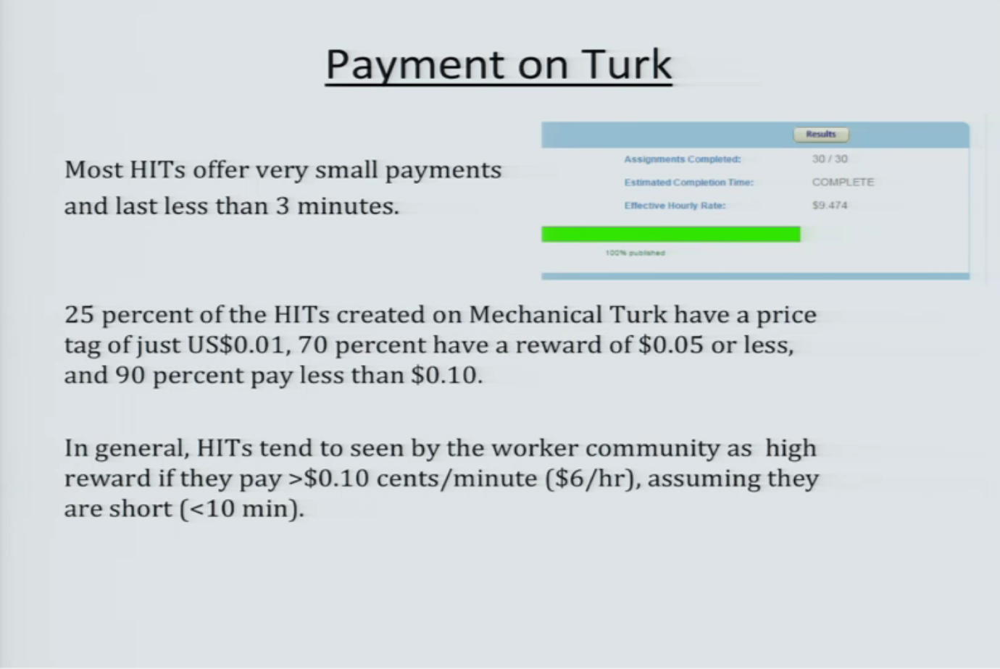
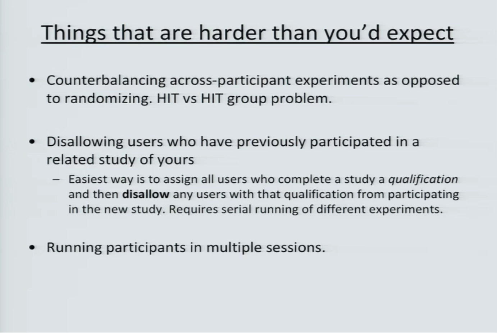

## Sun 23 Jul

Watch [a tutorial about MTurk](http://mediasite.nuit.northwestern.edu/Mediasite/Play/75e2e88b7c6d494ab00e611d99da9c6e1d).



A point of consideration:
- Longer HITs limits how much people can choose easy tasks and ignore hard tasks
- Shorter HITs are more preferable because they are less demanding and therefore cheaper

So, efficiency is important! The faster they can complete the task, the more
they're willing to participate and the less you're gonna pay.

Might be even more important since the event version is hard (require a lot of
remembering of what is what since they don't have names).

Notice: tell people how long your HIT is going to take (it's important for
their decision)

Problem: how to prevent one guy from doing them all?

Problem: how to make sure people don't read versions of the same document?



## Mon 24 Jul

Met [Piek and Antske](https://docs.google.com/document/d/1B0wbkolXOEO9T5_z4y2MLr5_wtZnrnwpxjaxQAwWuaU/edit).

Started preparing the data and run exp-genres from scratch.

```
nohup ./manipulate-corpus.sh > ./manipulate-corpus.sh.out 2>&1 &
```

## Wed 26 Jul

Finished manipulation, now I can train `deep_coref`.

Keep running into problem with `deep_coref`. It expect test data so I have to
generate the test portion of manipulated corpora as well. Though I won't even
look at the results. 

## Thu 27 Jul

Submitted training `deep_coref` on all manipulated corpora.

```
[minhle@fs0 EvEn]$ scripts/train-deep_coref-all_version-sbatch.sh
Submitted batch job 1530120
Submitted batch job 1530121
Submitted batch job 1530122
Submitted batch job 1530123
Submitted batch job 1530124
Submitted batch job 1530125
```

All failed for same error :((((

```
  File "/var/scratch/minhle/EvEn/deep-coref/datasets.py", line 309, in __init__
    for ana in range(0, me - ms)])
ValueError: need at least one array to concatenate
```

Now I'm really stuck. I'll write 
[pilot study plan](https://www.overleaf.com/10453825hvxpswvcwkmb#/38944129/) 
instead.

TODO: running nn_coref on my corpora
1. Run pre-trained model, pre-extracted features to see if we get reasonable results
2. Extract features of original datasets and run pre-trained model, check if we get the same reuslts
3. Extract features of modulated datasets and run pre-trained model
4. Train new models on modulated train datasets and evaluate on modulated dev datasets 

## Fri 28 Jul

Measured the number of mentions that are far from their previous-in-chain:

```
import os
import re
from cort.core.corpora import Corpus
from collections import defaultdict
import numpy as np

path = '/Users/cumeo/Projects/spinoza/ulm-4/EvEn/data/conll-2012-manipulated/position_events/dev'
    
def get_chains(doc):
    span2mention = dict((m.span, m) for m in doc.annotated_mentions)
    id2chain = defaultdict(list)
    span2index = {}
    for span in sorted(doc.coref):
        id2chain[doc.coref[span]].append(span2mention[span])
    chains = sorted(id2chain.values())
    return chains

def find_sentence_id(span, doc):
    for sid, sspan in enumerate(doc.sentence_spans):
        if span.begin >= sspan.begin and span.end <= sspan.end:
            return sid
    return -1

distances = []
for fname in os.listdir(path):
    if re.search(r'auto_conll$', fname):
        with open(os.path.join(path, fname)) as f:
            corpus = Corpus.from_file('', f)
        for doc in corpus.documents:
            chains = get_chains(doc)
            for chain in chains:
                sids = [find_sentence_id(m.span, doc) for m in chain]
                distances.extend(sids[i]-sids[i-1] for i in range(1, len(sids)))

distances_np = np.array(distances)
print(distances_np.mean())
print((distances_np >= 5).sum() / float(len(distances_np)))
```

## Tue 1 Aug

Worked a bit on my thesis. The HIT hasn't finished yet. Probably I paid too little.

## Wed 2 Aug

Learned about external questions on Mechanical Turk 
[here](http://scottlobdell.me/2015/03/use-mechanical-turk-python-boto-crowdsource-tasks/)
and [here](http://kaflurbaleen.blogspot.nl/2014/06/in-which-i-battle-mturk-external-hits.html).

Now: learn to make a Flask website.  

## Mon 7 Aug

The [pair-based batch](https://requester.mturk.com/batches/2890261) I submitted
a week ago hasn't finished. Perhaps the compensation is too small.

I know how to publish static files on Kyoto now. I'll proceed on chunk-based
and document-based annotation.

## Tue 8 Aug

Finished the chunk-based interface but couldn't test it because the webpage
on Kyoto can't be accessed via https. Emailed Paul. 
  
## Mon 14 Aug

This is how to remove HITs:

```
from boto.mturk.connection import MTurkConnection
key_file = 'mturk/aws-key.txt'
with open(key_file) as f:
    keys = dict(line.strip().split('=') for line in f)
HOST = 'mechanicalturk.sandbox.amazonaws.com'
c = MTurkConnection(aws_access_key_id=keys['AWSAccessKeyId'],
                    aws_secret_access_key=keys['AWSSecretKey'],
                    host=HOST)
for h in c.search_hits(page_number=1):
    c.disable_hit(h.HITId)
```

Try doing my chunk-based HITs:

# start 13:28 - end 13:30

## Mon 21 Aug

Submitted some chunk-based tasks to Amazon. Will anyone work on them?

## 22 Aug - 04 Sep

Some people tried chunk-based tasks. They find them easy.

Found out that I didn't put a "submit" button in pair-based design.

Had a meeting with Antske and Piek: if the chunk-based design is better, do it.

Worked out how to exclude workers using MTurk qualification system.

## 05 Sep 2017

Carry on with my pilot study. Started the first part: pair-based design with
1 question per HIT.

Got some feedback from worker (answers for the question "what do you find difficult"):
- The square-bracketed phrases are nested. Not sure what the 'latter' mention would be.
- this one requires some judgment. I could see either way
- 'agreed' is not a noun phrase
- It's slightly confusing.    
- question 2 is worded oddly. I don't know if you want the bold word or the noun the bold preposition is in place for.
- 'agreed' not NP 
- Lack of understanding of what you are really looking for.
- Nothing, but not sure what YOU are getting from this.
- I had to think twice because they both refer to or mention the Quaker Oats company, but actually the first one refers to a drink made by that company.
- 'last word' might be "'s"
- Deciding whether "That" referred to Pepsi, or the purchasing of stocks.
- From context you would not know. I only know because I've done several previous of your HITs about the same topic
- The way this question is phrased, "What is the last word in the latter mention in bold?"
- instuctions
- the placement of commas 
- There is a bug. This is what I see: [<b>Quaker Oats '</b>] Gatorade sport drink]
- There is only one word or phrase in bold in this hit.
- Only one bolded section
- bug: 'agreed' is not a noun or noun phrase
- In the first sentence, it is not certain from the grammar whether 'their' refers to Quaker or Pepsi stock, and so you have to use knowledge of how company buy outs are carried out.
- It was fine 
- maybe give some examples of what you want?
- 'agreed' not a noun phrase
- Question 2 is worded confusingly. Im not sure if your wanting me to put Gatorade or ceral. Do you mean what is the second word that is in bold letters or the last word in the sentence
- Lack of understanding of what you really want. 
- Not quite enough context

Next up: 
- pair-based design with 2 questions per HIT
- chunk-based
- document-based

## Wed 13 Sep

Waited for Antske to comment on the design but she's quite busy. Anyway...

I resubmitted the HITs that got incorrect validate answers. When it's done, 
I'll start the next task.

## Thu 14 Sep

Found a particularly bad case of overlapping mentions. I should have removed
those pair before hand.

```nested mentions: [$ 13.4 billion of [their] stock , but the assumption of $ 761 million in debt]```

This mention can be difficult for many people:

```<Unknown Speaker>: [That] comes to 2 % less a share than Pepsi 's original offer .```

Bug: not just that parentheses don't match, part of the mention is not bold.
But since I remove all nested pairs, this sholdn't matter any more.

```<b>[Quaker Oats ']</b> Gatorade sport drink]</b>```

## Sat 16 Sep

Trying to reproduce iSRL for LREC. Now I need to re-install everything. Luckily
I still have enough scripts.

Found [a very weird commit](https://bitbucket.org/cltl/isrl-sp/commits/4fbce8279c8185c87868d61a3abf73575bf19705) in April that breaks everything:

``` 
4fbce8279c8185c87868d61a3abf73575bf19705
switched to separate weights for different roles
```

I guess it was close to a deadline, I panicked (just as I'm now) 
and try to get some results.

OK, I get it now. The idea is to fix the position of roles (i.e. the filler of
role A0 always take up the first place, A1 second, etc.). Roles that are not
found in the text is filled with a dummy value. See the code 
[here](https://bitbucket.org/cltl/isrl-sp/commits/4fbce8279c8185c87868d61a3abf73575bf19705#Lextract_ontonotes_frames.pyT79)


Rerun preparation scripts though I might need to run them again when I manage
to change the model back to normal. 

```
ubuntu@ip-145-100-58-213:/mnt/isrl-sp$ cat ./prepare.sh
python3 -u convert-ontonotes-dependency.py
python3 -u extract_ontonotes_frames.py
ubuntu@ip-145-100-58-213:/mnt/isrl-sp$ nohup ./prepare.sh &
[1] 7933
```

I should have done this long ago but probably I was too bogged down to the 
details that I forgot. Aggregation function (to summarize f_j), the use of 
non-pronoun coreferent expressions, activation function, dropout are also important 
hyperparameters that I really need to tune. I tried only cube without dropout
and was so sad that it doesn't work. But I should have run all of them and
picked the best.

So now I'll do just that:
1. max + cube
2. max + tanh
3. max + sigmoid
4. max + cube + dropout(0.5)
5. max + tanh + dropout(0.5)
6. max + sigmoid + dropout(0.5)
7. sum + tanh + dropout(0.5)
8. max + tanh + dropout(0.5) + coref
9. max + sigmoid + dropout(0.5) + coref
10. sum + tanh + dropout(0.5) + coref

OK, started on HPC Cloud:

```
ssh ubuntu@145.100.58.213
nohup pair_models/exp_hyperparameters.sh &
tail -f out/exp_hyperparameters-01.out
tail -f out/exp_hyperparameters-02.out
```

Now I'll just wait...

When comparing my model with Filip's, I realize a potential problem: I was applying
softmax on the set of candidates instead of the whole vocabulary. And each
set of candidates has only about 100 elements (?) i.e. many words in the 
vocabulary is not updated.

## Mon 18 Sep

Experiments finish already. At least that means my code is still good.
However, the results on OntoNotes is still kind of the same. So basically 
the method is already as good as it could be.

```
ubuntu@ip-145-100-58-213:/mnt/isrl-sp$ grep "Valid accuracy" out/exp_hyperparameters-01.out | sort | tail -n 1
    Valid accuracy: 0.472405
ubuntu@ip-145-100-58-213:/mnt/isrl-sp$ grep "Valid accuracy" out/exp_hyperparameters-02.out | sort | tail -n 1
    Valid accuracy: 0.466671
ubuntu@ip-145-100-58-213:/mnt/isrl-sp$ grep "Valid accuracy" out/exp_hyperparameters-03.out | sort | tail -n 1
    Valid accuracy: 0.427514
ubuntu@ip-145-100-58-213:/mnt/isrl-sp$ grep "Valid accuracy" out/exp_hyperparameters-04.out | sort | tail -n 1
    Valid accuracy: 0.459254
ubuntu@ip-145-100-58-213:/mnt/isrl-sp$ grep "Valid accuracy" out/exp_hyperparameters-05.out | sort | tail -n 1
    Valid accuracy: 0.439481
ubuntu@ip-145-100-58-213:/mnt/isrl-sp$ grep "Valid accuracy" out/exp_hyperparameters-06.out | sort | tail -n 1
    Valid accuracy: 0.382530
ubuntu@ip-145-100-58-213:/mnt/isrl-sp$ grep "Valid accuracy" out/exp_hyperparameters-07.out | sort | tail -n 1
    Valid accuracy: 0.440930
ubuntu@ip-145-100-58-213:/mnt/isrl-sp$ grep "Valid accuracy" out/exp_hyperparameters-08.out | sort | tail -n 1
    Valid accuracy: 0.459862
ubuntu@ip-145-100-58-213:/mnt/isrl-sp$ grep "Valid accuracy" out/exp_hyperparameters-09.out | sort | tail -n 1
    Valid accuracy: 0.409439
ubuntu@ip-145-100-58-213:/mnt/isrl-sp$ grep "Valid accuracy" out/exp_hyperparameters-10.out | sort | tail -n 1
    Valid accuracy: 0.454174
```

Now I really need to do ON5V. Otherwise it makes no sense to publish anything.

Found footnote 12 in Moor et al. (2013). It's like my master's study all over
again. Perhaps the poor results I got before were due to this footnote (did I 
really get any results on ON5V? I can only vaguely remember).

## Thu 21 Sep

Fixed some bugs, run ON5V evaluation using my own code. Got terrible result (8%).

Before going home, I started another experiment:

```
nohup python3 -m pair_models.exp_coherence_with_synsem_features 927 2>&1 > out/coherence-with-synsem-on5v.txt &
```

Found 3 instances of "A1" in OntoNotes (A1 Tank and A1 Grand Prix) but they 
ain't head of any filler. Anyway, I should have separate roles and tokens
in the vocabulary. I tried to do it but it's way too complicated now.

```
Minhs-MacBook-Pro:annotations cumeo$ pwd
/Users/cumeo/ulm4/isrl-sp/data/ontonotes-release-5.0/data/files/data/english/annotations
Minhs-MacBook-Pro:annotations cumeo$ python3 count_roles.py
Examined 13108 files
Found 0 instances of role A0
./bn/cnn/02/cnn_0254.parse
./bn/cnn/02/cnn_0266.parse
./wb/sel/27/sel_2752.parse
Examined 13108 files
Found 3 instances of role A1
Examined 13108 files
Found 0 instances of role A2
Examined 13108 files
Found 0 instances of role A3
Examined 13108 files
Found 0 instances of role A4
```

## Mon 25 Sep 2017

Implemented a new experiment: use selectional preferences as a feature for
Feizabadi and Pado's model. Ran on HPC, revision 5aabd7d29ce6eb12283cdfe3f95edd2a7c92d3d0

```
ubuntu@ip-145-100-58-213:/mnt/isrl-sp$ nohup ./try_coherence_as_feature.sh &
ubuntu@ip-145-100-58-213:/mnt/isrl-sp$ cat nohup.out
Output dir: out/2017-09-25-5aabd7d/9272
Log is written to: out/2017-09-25-5aabd7d/9272/exp_coherence_model.py.out
Model: out/2017-09-25-5aabd7d/9272/coherence-model.pkl
Reading data... Done.
Train: 577595, valid: 64178
Building model...
Reading embeddings...
 1000  2000  3000  4000  5000  6000  7000  8000  9000 10000
```

I want to experiment with the SP model being a candidate filter too but that'll
have to wait until tomorrow.

## Tue 26 Sep 2017

New results of coherence+F&P at:

- `out/2017-09-26-ff72233/292751/`
- `out/2017-09-26-ff72233/2965292/`
- `out/2017-09-26-ff72233/9272/`

2 other attempts failed because learning rate was too big.


Started to implement ON5V preprocessing.

## Wed 27 Sep 2017

Process ON5V into Tiger XML format and do cross-validation. The preprocessing
takes quite some time so I run it on server:

```
ubuntu@ip-145-100-58-213:/mnt/isrl-sp$ nohup python3 preprocess_on5v.py 2>&1 > preprocess_on5v.py.out &
```

Evaluated F&P on ON5V (features were computed on SemEval). Got embarrassing results:

```
ubuntu@ip-145-100-58-213:/mnt/isrl-sp$ tail out/2017-09-27-working/exp_dni_on5v.py.out
[0.2, 0.2222222222222222, 0.0, 0.058823529411764705, 0.024242424242424242, 0.1, 0.0, 0.0, 0.05555555555555555, 0.0]
[0.15555555555555556, 0.13333333333333333, 0.0, 0.043478260869565216, 0.012121212121212121, 0.041666666666666664, 0.0, 0.0, 0.04, 0.0]
[0.175, 0.16666666666666666, 0, 0.05, 0.01616161616161616, 0.058823529411764705, 0, 0, 0.046511627906976744, 0]
```
(first row: P, second: R, last: F1, 10-fold cross validation)

Mean F1 = 5.1%

## Thu 28 Sep 2017

Got even more embarrassing results with coherence+F&P. It doesn't make sense...

```
ubuntu@ip-145-100-58-213:/mnt/isrl-sp$ tail out/2017-09-28-working/9272/exp_coherence_model_as_feature_for_feizabadi_pado.py.out
[0, 0.3333333333333333, 0, 0.0, 0.0, 0, 0, 0, 0.0, 0.0]
[0.0, 0.06666666666666667, 0.0, 0.0, 0.0, 0.0, 0.0, 0.0, 0.0, 0.0]
[0, 0.1111111111111111, 0, 0, 0, 0, 0, 0, 0, 0]
```

Found out why: all positive examples get low selectional preference scores: 

```
ubuntu@ip-145-100-58-213:/mnt/isrl-sp$ grep Yes out/2017-09-28-working/9272/exp_coherence_model_as_feature_for_feizabadi_pado.py.out
"A0,A1,A2",noun.Tops,__NULL__,NN,NP,0,False,False,False,__NULL__,q2,Yes
"A0,A1,A2",noun.Tops,__NULL__,PRP,PRP,0,True,False,False,__NULL__,q1,Yes
"A0,A1,A2,A3",noun.Tops,__NULL__,NNS,NP,0,False,False,False,__NULL__,q1,Yes
"A0,A1,A2",noun.Tops,__NULL__,NN,NP,1,False,False,False,__NULL__,q1,Yes
"A0,A1,A2,A3",noun.Tops,__NULL__,NNS,NP-LGS,0,False,False,False,__NULL__,q3,Yes
"A0,A1,A2",noun.Tops,__NULL__,NNS,NP-SBJ,2,False,True,True,__NULL__,q1,Yes
```

More precisely, 486/549 examples get <0.2:

```
In [12]: lines = open('out/2017-09-28-working/9272/exp_coherence_model_as_feature_for_feizabadi_pado.py.out').readlines()

In [13]: lines_yes = [l for l in lines if 'Yes' in l]

In [14]: import csv

In [15]: from collections import Counter

In [16]: c = Counter()

In [17]: for row in csv.reader(lines_yes):
   ....:         c[row[10]] += 1
   ....:

In [18]: c
Out[18]: Counter({'q1': 486, 'q2': 45, 'q4': 9, 'q3': 9})
```

I think the problem is simply there're too many candidates and the model wasn't
good enough to have a sharp distinction between them. Maybe it's better to use
relative ranks. Let's try that.

Switching to ranks reveals a clear signal:

```
In [1]: lines = open('out/2017-09-28-working/9272/exp_coherence_model_as_feature_for_feizabadi_pado.py.out').readlines()

In [2]: lines_yes = [l for l in lines if 'Yes' in l]

In [3]: import csv

In [4]: from collections import Counter

In [5]: c = Counter()

In [6]: for row in csv.reader(lines_yes):
   ...:     c[row[10]] += 1
   ...:

In [7]: c
Out[7]: Counter({'top50': 15, 'top5': 12, 'top20': 11, '50+': 8, 'top10': 5})

In [8]: lines_no = [l for l in lines if ',No' in l]

In [9]: c2 = Counter()

In [10]: for row in csv.reader(lines_no):
    c2[row[10]] += 1
   ....:

In [11]: c2
Out[11]: Counter({'50+': 959552, 'top50': 337500, 'top20': 113816, 'top10': 57854, 'top5': 52677})

In [12]: sum(c2.values())
Out[12]: 1521399

In [14]: [(k, v/1521399) for k,v in c2.items()]
Out[14]:
[('top50', 0.22183529764381335),
 ('top20', 0.07481009255297262),
 ('top10', 0.03802684239965979),
 ('top5', 0.03462405325624639),
 ('50+', 0.6307037141473079)]
```

Holy shit, I still get a lot of zeros:

```
ubuntu@ip-145-100-58-213:/mnt/isrl-sp$ grep '\[0' out/2017-09-28-working/9272/exp_coherence_model_as_feature_for_feizabadi_pado.py.out
[0, 0.3333333333333333, 0, 0.0, 0, 0.0, 0, 0, 0.3333333333333333, 0.0]
[0.0, 0.06666666666666667, 0.0, 0.0, 0.0, 0.0, 0.0, 0.0, 0.04, 0.0]
[0, 0.1111111111111111, 0, 0, 0, 0, 0, 0, 0.07142857142857142, 0]
```

why???

meeting with Antske: 
- coreference resolution --> finding out sets of errors where it can solve
e.g. inanimate things that after linking, does animate actions, events that
aren't supposed to go with each other (what???)

## Fri 29 Sep 2017

Trying to do an error analysis for ON5V. Why does my system get such bad results?
Is it because the frames are particularly hard?

To do an error analysis, I need a development set (taken from OntoNotes) but
I already used everything for training. So now I have to train everything
again >"<

```
ubuntu@ip-145-100-58-213:/mnt/isrl-sp$ nohup python3 -m pair_models.extract_on5v_frames &
...
ubuntu@ip-145-100-58-213:/mnt/isrl-sp$ nohup python3 -m pair_models.exp_coherence_model 92285 &
ubuntu@ip-145-100-58-213:/mnt/isrl-sp$ tail -f nohup.out
Model: out/2017-09-29-working/92285/coherence-model.pkl
Reading data... Done.
Train: 570304, valid: 63368
...
```

Another problem is that F&P features were based on statistics of SemEval data.
I need to compute new statistics against OntoNotes.

It doesn't make sense because there're so many unique values of frequency
in OntoNotes. I'll need to take logarithm of it.

```
ubuntu@ip-145-100-58-213:/mnt/isrl-sp$ cut -f 2 data/lemma-frequency-semeval.txt | sort -g | uniq | wc -l
86
ubuntu@ip-145-100-58-213:/mnt/isrl-sp$ cut -f 2 preprocessed_data/lemma_frequency_ontonotes.v1.txt | sort -g | uniq | wc -l
987
```

Done counting lemmas. Started computing role frequencies:

```
ubuntu@ip-145-100-58-213:/mnt/isrl-sp$ nohup python3 compute_role_percentage_ontonotes.py > compute_role_percentage_ontonotes.py.out 2>&1 &
```

Retraining of coherence model is also running:

```
ubuntu@ip-145-100-58-213:/mnt/isrl-sp$ nohup python3 -m pair_models.extract_ontonotes_frames &
ubuntu@ip-145-100-58-213:/mnt/isrl-sp$ tail -f nohup.out
...
Epoch 890:
    Train NLL: 1.414794
    Train accuracy: 0.565400
    Valid NLL: 1.753261
    Valid accuracy: 0.464272
    Example:
        Predicate: be.01
        Role: A2
        Predicted filler: worse - worse (wrong)
Best model saved into out/2017-09-29-working/92285/coherence-model.pkl
```


TODO: Crowd-sourcing problem: how to prevent one guy from doing them all?

TODO: Crowd-sourcing problem: how to make sure people don't read versions of the same document?

TODO: why mention identification doesn't get 100%?

TODO: answer Piek's questions:
[meeing 15 June](https://docs.google.com/document/d/1EPrOlPj4LmViKHhFw-o-NGUbanE2Hu7fLXcvRzxijfU/edit#) and 
[meeting 10 July](https://docs.google.com/document/d/186KLhtfzzJ6rQ2dlhvWefZZJbpfzqWWW3HwRCxHIs_4/edit). 

TODO: survey SP literature

TODO (iSRL): make a simple baseline using crude selectional preference rules
(e.g. A0 is always a person, A1, A2 cannot be certain things). make a slightly
more complicated model using frequencies measured on OntoNotes. what is the
overlap of verbs between OntoNotes and SemEval?

TODO (EvEn): evaluate the manipulated data manually

TODO: contact Bejan & Harabagiu to get event coreference annotation of ACE 2005

Bejan, C. A., & Harabagiu, S. (2010). Unsupervised Event Coreference Resolution with Rich Linguistic Features. In ACL 2010 (pp. 1412–1422).

TODO: (iSRL) recency weighting as in Do et al. 2017
