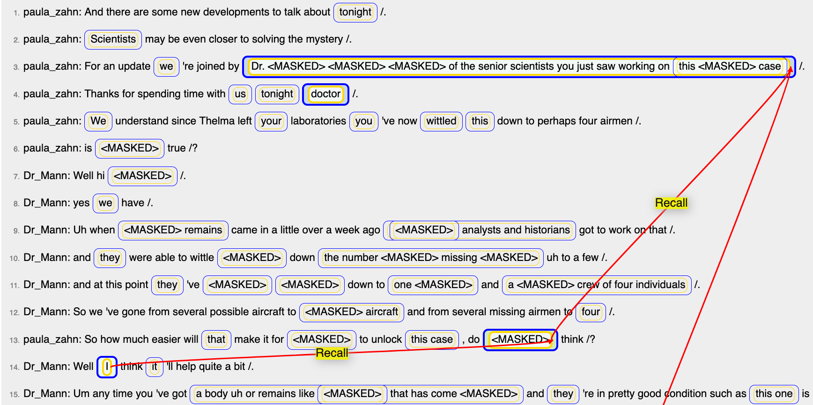
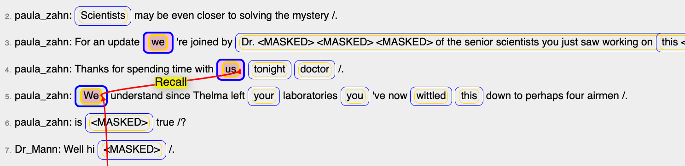
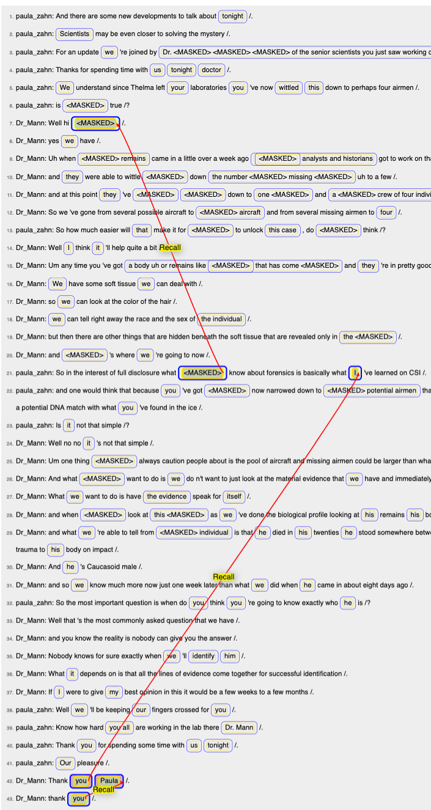
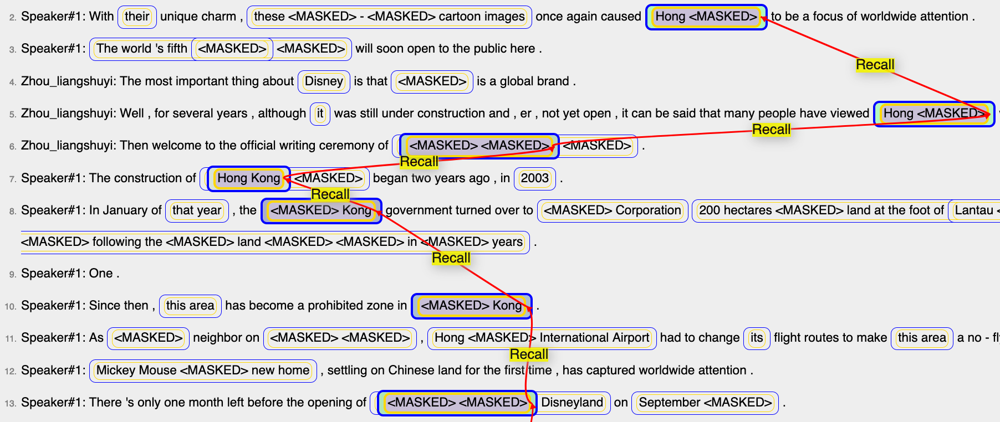
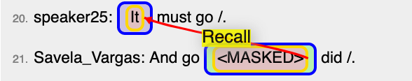
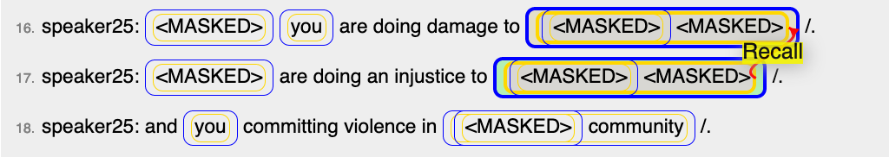

# Comments

## Switch in topic: broadcast new?

User: student1, document: student1-2019-03-14-question-006.html, timestamp: 2019/04/04 8:37:21 pm EET
--> Seems like there is a switch in topic. The last few sentences are hard to discern who said what. 

User: student1, document: student1-2019-03-14-question-020.html, timestamp: 2019/04/08 10:58:28 am EET
--> Seems like there was a topic switch half way through the lines, but this is hard to tell since the subjects seem to be missing. I think there is a subject change because the text seems to be talking about Michael Jackson and then about a case with a girl named Erin Runnion. 

User: student1, document: student1-2019-03-14-question-023.html, timestamp: 2019/04/08 5:36:06 pm EET
--> Not sure if all of the sentences are related to each other. 

## Typo and other mismatches

User: student1, document: student1-2019-03-14-question-010.html, timestamp: 2019/04/05 9:31:32 am EET
--> Typo between the retirement home, which is first written as Huntingdon and towards the end is written as Huntington. 

User: student1, document: student1-2019-03-14-question-011.html, timestamp: 2019/04/05 9:45:45 am EET
--> [some of [you]]

## Confusing, difficult documents

User: student3, document: student3-2019-03-29-question-003.html, timestamp: 2019/04/05 11:18:14 am EET
--> It was difficult to keep track of what the blank spaces mean. Furthermore, there is certain world knowledge needed to be able to assume what should be in the blank spaces.

User: student1, document: student1-2019-03-14-question-013.html, timestamp: 2019/04/05 12:31:06 pm EET
--> Difficult having so many blank words at the beginning of the text. 

User: student3, document: student3-2019-03-29-question-008.html, timestamp: 2019/04/06 1:43:04 pm EET
--> Especially the first text was hard to read. There were a lot of blank spaces that I could not relate to the rest of the text. The later, shorter texts were easier to solve, but still difficult due to the amount of blanks.

User: student2, document: student2-2019-03-29-question-015.html, timestamp: 2019/04/07 4:07:14 pm EET
--> This one was the most confusing one so far. There are simply so many words missing that I expect I made a lot of mistakes.

User: student2, document: student2-2019-03-29-question-018.html, timestamp: 2019/04/07 4:46:31 pm EET
--> Very confusing due to many missing words, but I hope I have managed to guess right where I could.

User: student1, document: student1-2019-03-14-question-018.html, timestamp: 2019/04/08 10:15:55 am EET
--> The annotations with multiple embedded empty blanks.

User: student3, document: student3-2019-03-29-question-011.html, timestamp: 2019/04/08 4:44:35 pm EET
--> The term aaproprations bill. It was unclear if the term always meant appropriation bills in generel or a specifif bill

# Interesting cases

Mentions of speakers:

Pronouns: subject, object, possessive:

Long coreference relations:

Ease cases of masked names:

Parallel structures:

