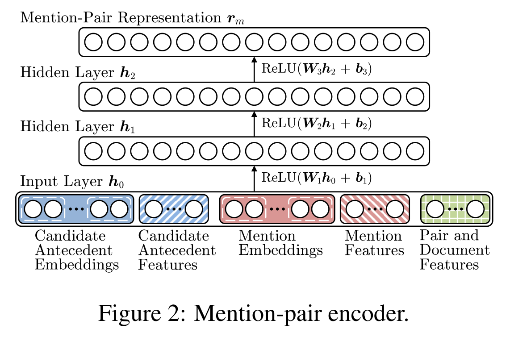

The most problematic aspect of this program is long training time: it takes
"[roughly 7 days on a GTX TITAN GPU](https://github.com/clarkkev/deep-coref)".
While we can reduce the pain by tuning hyperparameters on a small dataset,
it still takes so long to run it 10 times to obtain variation estimates.
Is there a way to optimize it?

Critical function (one that takes long):

run-all.sh > main > train\_best\_model > train\_pairwise > pairwise\_learning.train

pairwise\_learning.pretrain also takes a lot of time.

The model is built in this method: `pairwise\_models.py.build\_graph`.

Training progress by batches, each one is a document (except big documents
which are split into chunks). Therefore the size of data pushed to a GPU is not
ideal. The batches I examined contained 21, 127, 96, 29, 24, 23, 18, 32, 94, 103
mentions (mean = 56.7) and 3486, 666, 141, 210, 1305, 406, 55, 2775, 325, 6903, 210
pairs (mean = 1498). This size is not ideal for GPU. Besides, the matrices are
loaded into CPU, transferred to GPU and used there only once which is very
uneconomic. 

### Embeddings

Looks like embeddings are not trainable: datasets.py, line 88. Projecting
the words into space would enlarge the dataset. Why did they do so?

### Document features

Document embeddings: preprocessing.py, line 28, not trainable

Seem not used? In pairwise model, inputs include:

      "anaphors",
      "words",
      "spans",
      "mention_features",
      "antecedents",
      "pair_antecedents",
      "pair_anaphors",
      "pair_features"